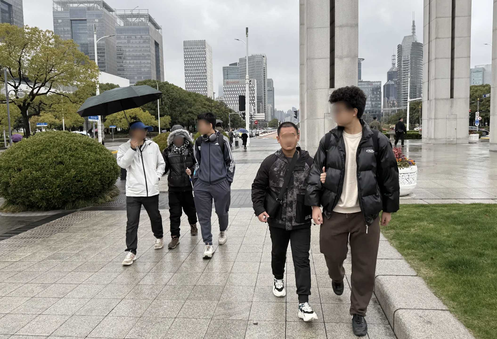

# Two Years at BAID: Let's Start From Here

_This is a sequel to [One Year at BAID: Footsteps of Growth](https://dreta.dev/blog/2024/07/01/one-year-at-baid-footsteps-of-growth/)_ and [_Seeing The People Who Couldn't See_](https://dreta.dev/blog/2025/03/23/seeing-the-people-who-couldnt-see/).

* * *

Over summer 2024, I was bored. There weren't many assignments over the break, and I finished them in a breeze. Afterwards, there didn't seem to be anything to do.

I decided that I want to expand my perspective a little bit, but mostly just to find something to entertain myself. "Why don't I volunteer?" I thought. The only problem—I'm too shy, and I could hardly stand the thought of having to talk to someone in real life. Instead, I opted to do something online.

I didn't know where I wanted to start. I scrolled through the countless volunteering programs available on the _terribly made_ "Volunteering Beijing" website. All of them, however, either don't take minors or aren't interesting to me. There was one program that caught my eye, however: the _Hequn_ volunteering platform, where both minors and adults can participate.

On there, a blind high school student is finding an English tutor. Sounds like something I can help with! I'm pretty confident in my English abilities. After reading the job description, I was so moved by his thirst for knowledge—despite all the challenges he must be facing, he was determined to learn. And I was ready to help—to bring the light to someone who couldn't see.

The first session was scheduled for late July, and it went moderately well. There were a couple of hiccups, however. For one, I had grossly overestimated his English level. He was in high school, so I naturally assumed that he would have basic mastery of middle school English. Turns out, however, because of high staff turnover at his special ed school, he has never learned English systematically. His English abilities were limited to the alphabet and some basic words, so I had to redo the teaching material the night before the session.

Afterwards, everything went smoothly. After a few sessions, he invited two other girls from his homeroom to learn English with me. And it appears that he has also recruited other tutors for different subjects. Before each session, I would chat with him for a little bit. He lives in Hebei, the province bordering Beijing. He attends a special ed school. And even though he doesn't quite know what's going to happen, he wants to study, and he wants more access to knowledge. Yet because of his visual impairments, he finds it hard to understand intricate concepts.

I was deeply touched by his determination. "身残志坚" ("disabled in body but firm in spirit")—that's the word to describe him in Chinese. They were a weak part of society, and people like me who are normal and kind must step in to help. I should do something!

It was into September, and I requested an interview with them after one of the sessions. They happily obliged. Before the interview, I made a list of questions, with the assumption that people with visual impairments couldn't do anything at all. These questions included "Are you able to go to your classroom by yourself?" and "Can you brush your teeth on your own?"

During the interview, I expected them to be grateful, but instead, they only laughed awkwardly. I didn't quite understand what went wrong with the interviews.

I persisted. Before each weekly session, I would pester my students with the same questions. I tried not to be inclusive, only subtle. But they only responded with a few words and another awkward smile. Eventually, I had to ask, "Why won't you guys answer my questions?"

In exchange, he asked, "Why do you think we need your help?"

"I’ve met a lot of people like you. They mean well, but they don’t realize they’re being condescending. Yes, some of us do need help—but if you really want to help us, you need to see us as equals, not as people beneath you, _for we are human, too._"

> **Yes, some of us do need help—but if you really want to help us, you need to see us as equals, not as people beneath you, _for we are human, too._**
> 
> — Liu D. C., my student.

He wasn't angry, just amused. But I was speechless. I had walked into that conversation believing I had the answers, but in reality, I had never truly listened.

I reflected for days. For the first time, I realized that nobody needed my “help” or my sympathy; instead, what they needed the most was understanding and respect. Disability isn't something to "overcome." It's not something to be "fixed." It's part of who they are—a different way of experiencing the world. My role wasn't to lead or rescue, but to listen, learn, and walk alongside. In trying to teach, I ended up being taught something far more important: humility.

* * *

A question naturally surfaced. What could I actually do? For one, I knew that I wanted to contribute something, for I often came across internet videos on the dire situation of accessibility in China, and I had always had an idea of “technology for good” in mind. Plus, I knew I had the skills to do something. I had spent the past year honing my skills in software development—working on the new school website, the school cafe ordering system, and others. I had also independently studied courses in mathematics, computer science, and academic writing. But then again, what could I actually do?

This was all happening as my friends and I were working on [Conrad Challenge](https://dreta.dev/blog/2025/03/23/seeing-the-people-who-couldnt-see/), a technological entrepreneurship competition. We scrambled to find an idea. During each discussion, our team of three would linger outside the classroom and over a small, brown cabinet to avoid disturbing people studying inside. We brainstormed ideas, put them down in a text document, and deleted them one by one once we realized that each of them had already been perfected. The corridor wasn’t well-lit, and we had to endure an occasional but unfathomable odor as we were right next to the toilet.

We couldn’t figure out what people with visual impairments actually needed, even after many hours of brainstorm sessions—online and offline. I liked to scratch my head while I thought about things, and after brainstorming, I was always left with an oily hand and an empty document, just as how we started.

Maybe more research was needed. I attempted to schedule another interview with my English students, but after the previous hiccup, they didn’t seem to be very interested in another potentially embarrassing chat. But just as we were hitting a wall, we found unexpected help beyond our school walls. Our school had launched a collaboration with the Institute of Accessibility Development at Tsinghua University.

The first lecture was held on a late November night. In the warmly-lit assembly hall, Professor Shao, the dean, introduced us to the principles of accessibility, its history, and its future.

This was my first formal introduction to accessibility. Until then, I had only had a vague idea of what accessibility was. It definitely wasn’t about charity—that much I had only come to realize after the awkward conversations with my students. But I still saw accessibility as something meant for "them"—for people with disabilities, as a layer of extra help on top of us "normal" people.

After the lecture, however, something changed in me. It felt like a fog I hadn’t known I was in had suddenly lifted. For the first time, I truly understood: accessibility wasn’t a favor. Instead, it was a foundation. In its broadest and most powerful sense, accessibility is a fundamental principle ensuring equal access and inclusion for all individuals—not just people with disabilities. It was about diversity. It was about equity. It was about inclusion. It was about respect. And I couldn’t believe how long it had taken for me to realize at.

> **Accessibility is a fundamental principle ensuring equal access and inclusion for all individuals—not just people with disabilities.** **And I couldn't believe how long it had taken for me to realize that.**
> 
> — Me, after the lecture on accessibility.

Just as Prof. Shao was about to pack up and leave, we stopped him. He was a tall and broad-shouldered man with a calm, benevolent presence that made one instinctively listen when he spoke. His face bore the undoubtable look of a scholar, with a quiet seriousness that didn’t demand attention but naturally drew it.

We shared our half-formed concepts and asked him to recommend an interesting yet doable direction. That was when he pointed us to a direction we hadn’t given much thought to: navigation. Not just turn-by-turn directions, but the problem of how a person with visual impairments moved through space, found their way, and made sense of an environment. Suddenly, I remembered the news articles and [books](https://dreta.dev/blog/2024/08/22/for-the-benefit-of-those-who-see/) I had read: tactile pavings blocked with poles, well-intended braille signs that couldn’t be found…

In that moment, those images connected into something urgent and real. I realized that I was someone with the tools and the time to do something. The more I thought about it, the clearer it became: inaccessible navigation wasn’t just an inconvenience—it was a barrier that stripped people of their independence and dignity every single day. After everything I had seen and learned, I couldn’t just sit there anymore.

At that point, we knew what we wanted to do.

* * *

But knowing the problem was only half the story. We still had to figure out _how_ to solve it. We had a general direction, but we didn’t have an exact gap yet.

We continued to brainstorm ideas while working through the vast literature on the subject of navigation apps for people with visual impairments. I was bleary-eyed one night, browsing through the vast library database, scrolling over paper after paper after paper, the Zotero reading list growing longer and heavier. The purplish-white accent of Web of Science felt like the vilest color ever known to mankind. Even after reading all these papers, I had not a single idea. These papers offered me knowledge on what was already there, but not an idea of where I might proceed.

But after reading twenty or so papers, I began to see a pattern. It was another brainstorm meeting, and I had a list of ideas in front of me. This time, I didn’t delete it all. Within, I discovered something—"What if we combined navigation and obstacle detection in one app?"

> **What if we combined navigation and obstacle detection in one app?**
> 
> — It was November 29, 2024, and a spark of idea lit up.

Initially, the idea seemed unremarkable. But we kept coming back to it even if we tried to ignore it. It seemed perfect—it hadn't been explored before, it was doable with our technological acumen, and maybe… it might be genuinely useful!

We finally presented our idea to Ms. Lynn, a researcher at the Institute of Accessibility Development. I had been nervously optimistic, as this was our first time sharing the idea—which we dubbed _Beacon_ for its ability to guide people with visual impairments—with someone who truly understood the field. I hoped she would see the potential, maybe even be excited.

It was after school when the disheartening message came with a soft notification chime on my phone. She put it in a really nice but dispirited way: "I don't see how navigation and obstacle detection are related. Do you really need to combine these two together?"

> **I don't see how navigation and obstacle detection are related. Do you really need to combine these two together?**
> 
> — Ms. Lynn, in response to our project.

Oh well, maybe we're back to ground zero again.

* * *

A few silent days passed by. There were no more notification chimes—nobody said anything in the group chat. It was happening as I was out sick with a high fever that rumbled in me whenever I tried to move.

The idea had earned us a silver medal during the [Conrad Challenge](https://dreta.dev/blog/2025/03/23/seeing-the-people-who-couldnt-see/), but we had done it solely for the competition, not with the intention of pushing it forward at all. We had even made a prototype—but it broke on presentation day, and we had to bluff over its bugs. After that, we were almost ready to move on from the failed idea that was Beacon. We had another idea, and Beacon was dead. I might as well just archive the GitHub repository and forget that it had ever existed—the only reminder being tucked away in an unremarkable entry of the “Honors” section of my Common App.

It was a gray, moody day. The afternoon after the presentation in Shanghai, we met a local community advocate along with two people with visual impairments. The meeting had taken place outdoors in the rain, under a crooked awning that barely kept us dry. The drizzle had soon turned into a steady patter, soaking the pavement with everything in shades of gray.

<figure>  
    < It was a gray, moody day. >  
</figure>

We hadn’t even brought up Beacon. We thought it was dead—flawed at its core and dismissed by the experts—so we told them about our other idea instead, something we had been toying with after the competition. They listened patiently and always gave us a courteous smile but didn’t seem particularly moved.

Almost casually, the conversation drifted, as we dried up and scrambled to find something else to talk about. One of them asked about what we had worked on before. We hesitated, then cautiously mentioned the idea of Beacon, just in passing. But then, a spark lit up.

_"I think that’s a great idea. That’s exactly what I would like to use."_

_"Having one app that could do all of it… you don’t need to switch between them!"_

The shift was instant. We straightened up. The fatigue that had weighed down our voices just minutes earlier began to lift. I grinned uncontrollably. We knew it—Beacon was no longer dead. Instead, it had been resurrected, piece by piece, and through their eyes. We showed them our rough prototype we thought we’d never touch again. They nodded, offered suggestions, and even small frustrations from their daily routines that Beacon was somehow already positioned to solve. The rain eased, and we were talking fast again. Beacon was alive.

* * *

Over the next few months, we rebuilt Beacon from the ground up. This time, it actually worked, integrating obstacle detection, traffic light detection, and improved navigation. We are now preparing for a small-scale user test in Egypt with the Baseera Foundation and in China with the Institute for Accessibility Development.

Today, it's July 16th, 2025. Alas, I have already spent two years at BAID!

This year, the key word is _discovery_: discovering a field in which I'm interested, discovering what I wanted to do in that field, and discovering the momentum that propels me forward.

I'll have to see what goes next!

_(July 16, 2025)_
