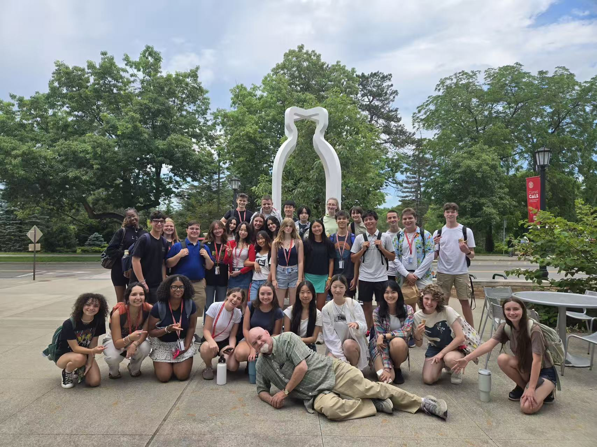
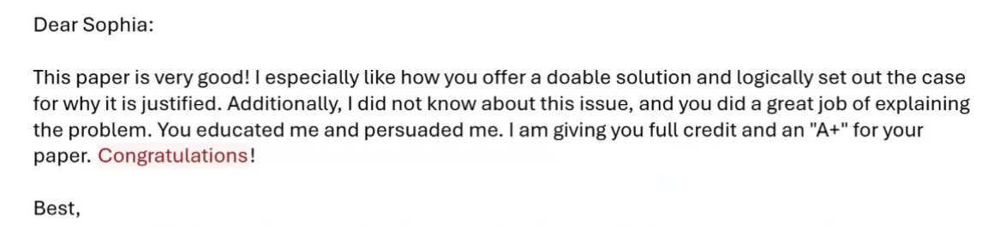
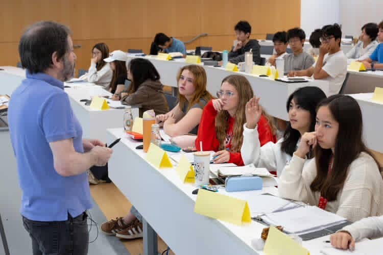
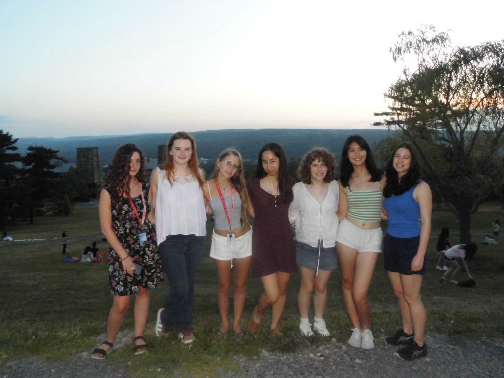

# 夏校reflections

*“I went to the woods…” ——Henry David Thoreau, Walden*

 
康奈尔的学分夏校并不是我在十年级夏天的第一选择。严格来说，它更像是我被YYGS waitlist后的一次“退而求其次”。但现在回头看，我无比庆幸自己来到了这里——因为它不仅没有让我失望，反而以一种意料之外的方式，丰富了我的暑假、扩展了我的认知，也帮助我重新认识了自己。学分夏校的课程安排不仅仅是把兴趣“学术化”，更像是一面镜子，让我不断审视并探索自己的性格与潜能。因为是国际生，我被要求必须修够6个学分，这也“迫使”我除了第一选择Engineering Applications of Operations Research以外在第一期报名了Advocacy&Debate这门课。虽然一开始带着点“被迫”的心态，但幸运的是，我一直以来对即兴演讲、表达与辩论抱有浓厚兴趣，也希望能在这一方面进一步突破自己。结果证明，这门课不仅没有让我感到勉强，反而成了我整个夏校体验中最精彩的部分。突破舒适圈也并非一味追求激进与挑战，而是愿意在一个不确定的空间中，用语言和思考为自己开辟出一条更清晰的路径。而另一门Engineering Applications of Operations Research则围绕数学建模和我在信息奥赛中学到的许多图论算法，完美的落在我的兴趣点上；虽是会带来不同的压力，但是总体来说同样是我极其享受的三周课程。

*“And I am out with lanterns, looking for myself” ——Emily Dickinson*

 
我们或许是唯一一个把教室桌椅围成一个圈上课的班级。教授强调的不是背诵定义、而是真正地“讨论”——关于事件，关于立场，关于逻辑，更关于我们作为说话者、思考者、行动者的存在。他希望我们不仅要“说”，更要“言之有物”，要成为真正能够站得住的、有理有据的人。这也正好呼应了我一直以来坚信的一个观点：公共表达并不属于某一个学科，它是一种普遍的能力，无论你将来从事的是理工科、商科、文科、还是社科，能清晰地说、敢有立场地说，是一项不可或缺的素养。而这个素养，就如教授在第一天就强调的，、并不只是备好稿子、精进自己的表演动作表情的“独白”，而是把有意义的思想pass on to more people的有意义的即兴表达。

我们的教授非常风趣，但他从不把自己摆在“讲授者”的位置。他更像是一位“挑衅者”——用各种极具争议的问题、极限的假设情境、甚至令人不安的伦理困境，不断逼我们跳出舒适区。第一节课他就提出一个震撼的问题：“如果我拿进来10只实验用狗，一只只踩死，并且告诉你这出于教育目的，而且我是一个具备权威的教授，你会做什么？”这个设定既血腥又荒诞，但没有人可以轻易逃避它。你知道这是错的，却很难找到一种强有力、且可执行的方式去阻止它。我们围绕这个问题展开了长达半小时的争论，也由此引出了trolley problem、Socratic method的局限与价值、以及我们生活中被忽视的伦理盲区。我们也模拟了Long Table Debate，在激烈交锋中体验到怎么识别、避免argumentation中fallacies的出现。虽然第一次debate我因为担心说错、说不好而错失了发言机会，事后懊悔不已，但也正是这种挫败感让我开始主动调整自己的心态。其实经过观察，那些当地的同学们在发言时并没有我想象的那么流利、语速快、有条理，但是他们从小的生活环境鼓励他们在想发言时直接争取、自信表达；于是对我来说，**突破的第一步是不再把“表现完美”作为目标，鼓励自己去尝试、去试错、去改进。**

有时候，我会想，语言是不是真的足够了？人类如此依赖它来交换思想、标定情绪、定义自己，可有太多时候，语言反而像一种折叠器——它剪碎、压缩，甚至屏蔽了人真正想表达的东西。有人无法说，有人不敢说，有人说了却从未被听懂。这也是为什么，学会语言之后，我们要去学习立论、有效的讨论、有益的争辩。

当初对YYGS的遗憾，早已在一次次讨论和表达中被慢慢消解。我开始明白，机会的意义并不在于“是不是第一选择”，而是你如何面对它，如何将一次“意外”转变为一次成长的机会。而在康奈尔的每一天，正是这样一次又一次的转变过程——从被动到主动，从紧张到热爱，从沉默到自信。康奈尔学分夏校绝不是什么竞争力大、公众认可含金量高的夏校，但只要把握住机会，它就会成为我经历中浓墨重彩的一笔，并为十一年级和不久的将来带来希望、留下价值。

最初，我选择的是commuter的方式，打算等后三周再切换到residential。可没过一周，我就按捺不住了——我想立刻搬进宿舍。就像有些同学即便家住在Ithaca，也会选择住校一样，社交在夏校的重要性丝毫不亚于学习。还记得从第一天到第二天，教室里的座位排列就发生了显著的变化——因为同学们利用课余时间主动去认识新朋友，迅速组建了各自的friend group。康奈尔的学分夏校没有被迫合作的小组任务，课堂更接近lecture，所以任何友谊都必须由自己去开口、去建立。我花在社交上的时间几乎与学业持平，甚至有时还多一点。但我从未后悔，因为我不想远赴美国，却仍生活在只说中文的小圈子里。

在白人同龄人的印象中，中国学生常常被视为安静、保守、不太主动结交非同文化背景的人。这种刻板印象确实存在，也在某些情况下有现实依据，但我不希望自己成为它的例证。初中时，我曾两次参加美国的夏令营：一次我幸运地结交了几位至今仍保持联系的美国朋友；另一次，我却在每次开口表达时都犹豫、并保持相对沉默。这也让我不禁去思索，作为高中阶段的第一次深度跨文化接触我会表现成哪一种自己。

我并不是那种对所有事情都要求完美的人，平日里反而随意。但一旦涉及到自我定位和追求，我常常渴望做到最好，为了“证明我可以”而陷入过度比较的循环。初中时，我没有很好地处理这种要强的心理，反而陷入了反复的自我怀疑。但这个夏天，我尝试将这种特质转化为优势，促使我主动去打破沉默比如我既然介意自己一个人单独坐着，那为何不主动发起small talk呢？于是，不论是在commute还是resident期间，我都收获了广泛的朋友。有时候，我甚至被其他中国同学误以为是ABC——这并不是因为我刻意去掩盖自己的真实身份，而是我真正学会了在不同的语境里自如切换，找到能与人真诚交流的节奏。

转去住宿的愿望在第二周愈发强烈，父母也十分理解，也就是在第二周的周末（刚好July 4th），我开启了我的住宿生活。最初的两天像一阵热烈的heatwaves，带着新鲜与兴奋的我报名了各种课后活动，迅速弥补了之前一周的空缺，参观了 Uris Library、植物园，和朋友一起参观与漫步在Downtown与College Town的街道上，在不经意的对话与笑声中认识了很多新朋友、也和想认识的人建立了连接。

然而，最初的狂欢过去，安静的空隙也随之出现。中午下课后，大段的自由时间被活跃的friend group填满，我们几乎形影不离。这种密集的社交让我意识到，哪怕在热闹和友谊的包围中，我依旧需要片刻的独处——去思考、去与自己相处、去take a break。**我开始尝试表达自己的需求，不再一味迎合，哪怕这意味着短暂地脱离集体。**这样的选择让我与朋友的关系反而更平衡，也让我能在movie night和game night之外，回到咖啡馆与自习室沉下心来准备Advocacy & Debate的final。

在这段社交与学习的交错中，我逐渐又找回了小时候的那种自信。来美国的中国学生，常常背负着一些刻板印象：课堂上沉默寡言、难以融入当地人的社交圈、只和中国人玩。我不想让这些标签成为我故事的注脚，所以努力去跨出语言与文化的边界，让自己能够在不同背景的人群中自如交流。那些身体被抽空一般的躺在床上瞬间、几天内下载了What’s App Snapchat TikTok DoorDash、唯唯诺诺的问出一些看似很蠢的问题、hear me out cake的slides的准备、傍晚在Libe Slope的笑声、离别时所有人急忙相聚在一起的热闹……都是我与这个环境互相磨合的过程。

**回想起来，我并不是去“表现自己比别人强”，而是去回应一种内心的渴望、去看到更多人、也让更多人看见我。或许，真正的跨文化交流并不在于学会更多slang，而在于一种由内而外的开放感：你愿意去倾听、去理解、去承认人与人之间的差异本身就有价值、去相信对方也愿意包容这些差异。**而这时我想要提到我们Advocacy & Debate的第一个论文作业，那个作业是按照problem/cause/answer/net-benefit结构写一个任意感兴趣话题的两页proposal，而我在思索过后决定选择中国老旧小区改造作为我的核心素材。认真写完论文过后我依然对我这篇文章有些担忧，直到在一个早晨惊喜的收到了：

这也让我意识到了我们不应该担心别人不理解、不知道，而是坦诚的作出自己最好的一面。这一advocacy assignment过后的两个paper都是要写关于美国劳工关系、工人权益、劳动法等等，而这也是我去倾听、去理解他们文化中的重要组成部分的时间。

*“More light! More light!” ——Anthony Hecht*

 
我原来的朋友们基本都走了，而我留下了，继续面对着未知和一切不确定性，但是我的内核稳定了。对更加拿手的学科知识，我进入了夏校的后三周，专注于Engineering Applications of Operations Research课程。相比辩论课中的语言探索，这里我面对的是完全不同的内容，课程涵盖了从数据科学与决策分析到经典优化问题比如traveling salesman problem、shortest path、minimum spanning tree、max/min flow、bipartite matching、baseball elimination、transportation problem、linear programming、integer programming、game theory等。每一个问题都通向一些算法，而每个算法都是通向解决复杂问题的工具。

这里，我感受到了一种如鱼得水的自在感——因为这些内容与我在信息学奥赛中积累的算法与图论知识高度契合，我能够迅速理解、灵活运用，也常常比同学们更快找到解决问题的思路。很多时候教授都因为我太积极了而特意说 “let’s hear from someone who hasn’t spoken yet”而让我等会再回答。然而，与舒适感并行的，是对“完美”的压力：我不再仅仅满足于完成题目，我希望做到精准、效率和优雅兼具，哪怕是一个小小的计算失误，也会让我内心紧绷。跟之前辩论我曾因本身就对自己没自信认为自己经验不足带来的烦恼不同，在这里，我则是面临着“擅长领域不能出错”的压力。但好在，我早已不是那个认为自己“会”就掉以轻心的自己了，我始终保持着初学者心态，虚心、认真面对每一天的课程。

课程中的讨论也让我意识到，数学公式和算法不只是冰冷的符号，它们是将抽象思维具象化、让复杂决策可操作化的语言。教授向我们展示了他们团队通过利用最基础的算法不断升级，应用并优化NYC出租车和共享单车系统的过程，为城市管理作出贡献，着实非常impressive。每一次我用Dijkstra找出最短路径，用Simplex优化线性规划，我不仅在求解问题，更在训练自己面对现实可能出现的场景的思考方式——如何在复杂的条件下理性决策、如何在有限资源中寻找最优解。而有时当教学内容和我原先的理解有所出入时，我也会主动和教授进行更深入的讨论，并从中持续调整。

回望这六周的课程部分，虽然不是最好的十年级夏天的选择，但是能够知足并利用机会、我也有了两种并行的突破：一个是语言与思维的自由舞台，让我学会在不确定中表达自己；另一个是数学与决策的实践空间，让我学会在不完美中追求精确与优化。而这两种突破最终汇聚成一个统一的体验，我不仅更加勇敢和自信的展现自己，也更清晰地理解自己的潜力和边界。

后三周的社交也更稳定，于是越是在这种被温柔包裹的时刻，时间越是悄无声息地溜走。可它留下的，却是无法磨灭的记忆。但我永远不会忘记给同学起外号差点变成霸凌、时隔多年在草坪上下腰和倒立、在半夜和朋友遛弯被一群白男骚扰、大巴车上和刚从YYGS回来的朋友兴奋的畅聊、在凌晨两点极其混乱的场面观看Love Island、第一次学会德州扑克、惊喜发现室友竟然是国内明星的女儿、脚崴了几个同学抬着我回教室、逃课去Cornell ornithology lab、开了一个多小时车去Syracuse商场逛了五个小时最后只买了一本书……可那本书，却像把整段时光压进了纸页里。

*“The Sea is History” ——Derek Walcott*

我想，这些日子像一幅拼贴画，热闹与温柔、喧嚣与宁静，彼此交错、互相成全。它们不只是记忆的素材，更是我理解自我与世界的坐标系。在这里，我学会了衡量边界与自由，感受人与人之间不可预知的温度，也一次次看见了更广阔的自己。当我坐上大巴驶离Cornell开往机场、看着窗外所有朋友挥手告别时，我知道，这不是结束，而是一种延伸——未来的每一段路，都将带着这些细节的纹理和颜色，向前铺展。
