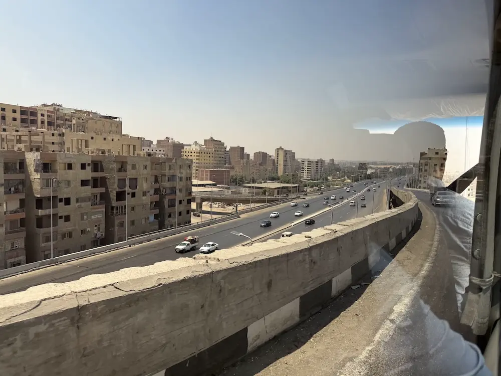
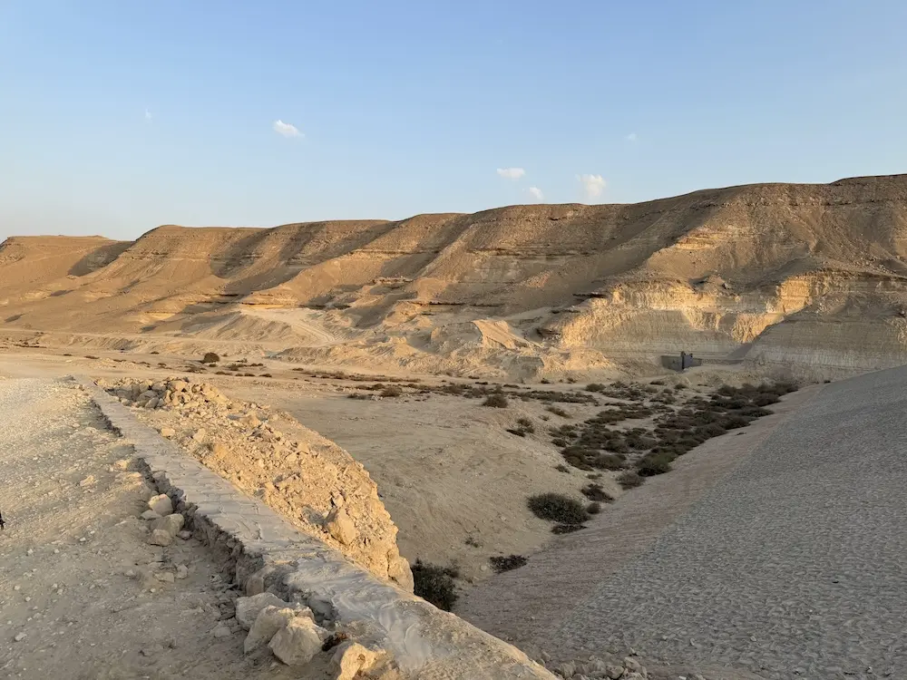
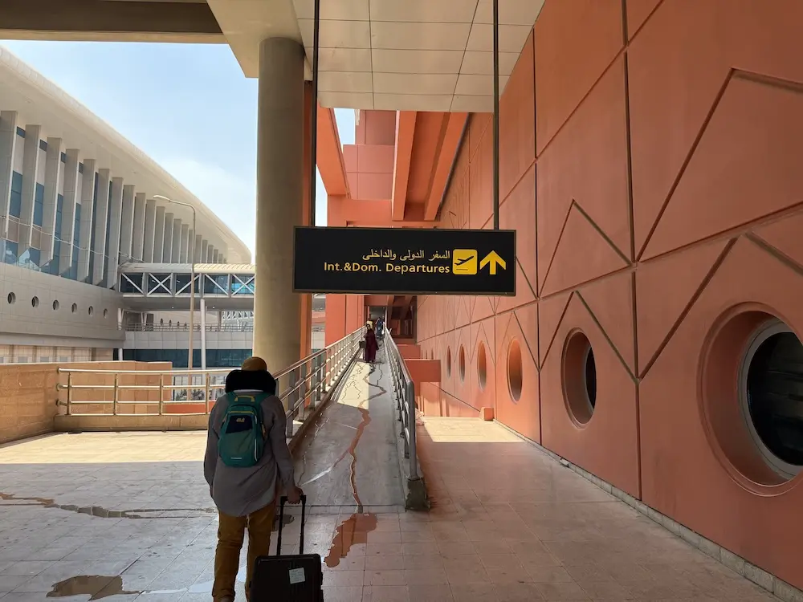

# "(No Longer) Stranger in a Distant Land"

The first time I saw Lina, I thought she wasn't Egyptian.

Granted, I didn't really know what Egyptian girls look like, but I do have this stereotypical idea in mind—for one, they probably wear hijabs. Lina, however, had no hijab; instead, she proudly displayed her curly, golden hair, along with her beautiful grayish-green pupils. She looked European.

That was just after our welcome orientation for the AFS Global STEM Academies summer program. Forty people, twelve countries, five continents, and we all sat together in front of one table. This was the first time I had ever met such a diverse group of people, and it certainly wasn't easy.

In the conference room, the overhead lamps cast everything in a soft yellow glow so that the whole space felt dim yet tinted in amber. People sat among themselves and talked among themselves. I didn't really notice at first, as I tried to walk around over the breaks, holding a cookie and looking at people from cultures so distinct from mine that some of their actions felt abhorrent. I tried to join some of their conversations, but to no real avail. They would respond with a nice smile and share a few words, but nothing beyond that. The most that they talked about was gossip, which I wasn't really interested in. I felt a bit outcast.

The welcome orientation passed like how rainstorms in Beijing do—passive and rapid. I immediately tensed up when I heard that our host families will pick us up... right now. The room was initially quiet but quickly burst into chaos as I saw parents rushing in and the panicking staff. One family I remember especially well; they made a huge cardboard, on it a red map of China and the words "Egypt, your second home." That was, of course, not my host family, but upon the sight, I wondered: will I get something like that as well? I didn't expect anything, though, for I saw most of the families only brought their bodies.

I spent a while pacing around the conference room, as everyone else seems to have already found their host families. My eyes set on person after person after person; they all looked the same. Either they were in suits and ties, or they had a colored hijab covering their head. Eventually, I found Lina, the sister, and Nancy, the mom, holding a sign that said, "_Welcome Lin!_" ... Out of everything that I had anticipated, I did not expect a welcome sign at all. And the warm smiles! And a genuine excitement in their eyes! I froze, and, out of the disbelief, tears poured out.

<figure>  
    < An exotic look. >  
</figure>

* * *

I couldn't help but be exhilarated on our way home. Ooh, these are the pyramids! Ooh, these are the palm trees! Ooh, that's the Nile! Every sight of Egypt had an exotic look to me. The houses were all sand-colored, rising in blocks without the tall silhouettes I was used to back in China. The roads buzzed with chaotic traffic, cars speeding without regard for lanes or lights. And above all of it, the sky was a brilliant blue without a hint of clouds.

I still remember the first lunch. I wasn't sure where to sit, so I picked a random spot at the table. Then Nancy smiled and gently pointed to a pair of chopsticks they had set aside, saying, _"You can sit here, with the chopsticks."_

> **You can sit here, with the chopsticks.**
> 
> — Nancy, the host mother.

I halted for a moment. Chopsticks? My eyes scanned the table until I found it. It wasn't like the typical ones we use in China; instead, it was delicately ornamented with blue crystals, more like an antique for collection than a utensil. I was shocked, not just at the sight of something so familiar in such a distant land, but at how much care it showed. I realized they had already thought deeply about what might make me feel at home.

The same quiet thoughtfulness showed again that evening when Nancy took me to the ice cream shop. Below the clear night skies unseen in Beijing, the car suddenly pulled over. I looked around—no light, no police, no traffic—and I was confused. Without a word, Lina opened the door, walked up to a man dragging a dented trash can, and handed him a box of our leftovers. He was homeless. I have never seen any homeless people in Beijing, and neither would anyone give out food so casually. I was surprised, not just with how visible poverty is, but at how effortlessly Lina acted, as if giving was second nature.

It wasn't just with strangers. When I struggled myself, they responded with the same instinctive consideration. Egypt was pretty hot in summer, and we didn't have an AC. One night, I was woken up at 3 a.m. to see my entire body and bed flooded in sweat. I tried to force myself back to sleep, but it was simply impossible. The next morning, when Nancy heard, she didn't hesitate to offer an AC for our room. It was swift. In just a single day, we had a shiny new unit, humming softly, offering a much-needed cool breeze. What struck me was how quickly she acted, as if my comfort were her own.

Lina and Nancy also took the time to share their kitchen with me. We first made _molokhia_, a slimy green soup that Egyptians love. I swing a crescent-shaped rocking knife, each swing making a crisp crunch-crunch over the fresh leaves. Later, we made _falafel_. I watched the pale green mash hiss in the oil, slowly covered in a delectable brown crust that filled the room with a nutty scent. Cooking with them wasn't just about food; in that moment, I felt less like a guest and more like family. It was just as Nancy said with a grin: _"Today you're a guest. And tomorrow, you are a part of our family!"_

> **Today you're a guest. And tomorrow, you are a part of our family!**
> 
> — Nancy, the host mother.

* * *

I had several incredible days with my family. They were always so loving, attentive, and considerate. The same couldn't really be said, however, with many of the other participants.

Ethan was a participant from the United States, embodying every idea of Americans I had in mind: blond hair, pale pink skin, and—most tellingly—swim trunks plastered with the American flag. He was absolutely obsessed with his nationality. One day, we joined an activity of introducing our home cities. Everyone else showcased their cities' unique foods, intricate cultures, and remarkable sights; Ethan, however, used the time to boast about America's military power and its ability to sanction other countries. When discussing current affairs, Ethan spoke in a consistently condescending tone, going so far to declare, _"One day, you will become American and join the civilized world."_ I soon realized that it was impossible to have a remotely interesting conversation without it spiraling down to egotism. Later that day, I learned a new phrase: _American exceptionalism_.

Harun was a tall, thin boy from India. He had a sly countenance, with his head constantly tilting forward, as if he was searching for something on your body. He seemed quite nice to everyone until he began to ask me inexplicable questions, such as _"Do Chinese people brush their teeth?"_ and _"Do Chinese people shower?"_ At first, I thought he was joking. But soon enough, I realized that they weren't curiosity at all—they were rooted in a set of ugly, racist stereotypes. I didn't know how to respond. How do you deal with a question that wasn't rooted in curiosity but malice?

These are the exceptions. I'd say that most people were very friendly. But even then, it's still very hard to dig deeper and have a conversation beyond surface level. Most people talked exclusively about gossip: this participant had a crush on that participant, this participant badmouthed that participant, and stuff.

Initially, I dismissed these gossips, thinking that that's just what us high school students enjoy sharing. But one night, I came to a realization. It's not that people only wanted to talk gossip; instead, that was the only thing people could talk about. A lack of mutual cultural context makes it almost impossible to enter deeper conversations. Without these shared references, gossip becomes the lowest common denominator—something everyone can understand.

> **A lack of mutual cultural context makes it almost impossible to enter deeper conversations.**

That was when I noticed a pattern: most people naturally talked within their own national groups. I realized I also felt more at ease when speaking with the other Chinese participants. In mixed groups, I often felt left out—now I understand why. I was the only "stranger" among them.

* * *

On Day 15, Nancy brought us to a local desert.

I've never been to a desert before. It was entirely different from what I imagined. Under the azure, cloudless sky was a rock; on it carved the text _"Wadi Degla Protected Area"_ in both English and Arabic. Beyond that, the land stretched empty, barren, and endless. The low hills rose on either side in layers of pale stone, glowing faintly gold when the sun touched their edges. For a moment, it felt as if the world had fallen away, leaving nothing but stillness, rock, and sky.

We walked among the sand, and a rare quiet I had long yearned for washed over me. At night, there was always the mechanical hum of the AC. By day, the endless chatter of people filled my ears. But out here, in the desert, there was only silence. Nothingness stretched in every direction. In the emptiness, I finally felt a sense of inner peace.

<figure>  
    < Endlessly stretching. >  
</figure>

The darkness soon devoured us. Under the glistening stars, we set up a blanket, started a fire, and began to barbecue. The fire glows orange against the surrounding sand and rocks, casting long shadows across the barren valley. Only the fire and the faint crescent of moon high above accompanied us.

Nancy offered me food. Juicy, mouthwatering sausage, perfect after the long walk. I lay on the blanket, earth firmly behind me, sky stretching endlessly above, and Jonas, the little brother, nestled close at my side. The fire crackled softly. The stars shimmered faintly. And the desert air carried a stillness unlike anywhere else.

Slowly, nature and family seemed to melt together. The comfort of Nancy's quiet care, the playful presence of Jonas, and the calmness of the desert night. It felt as though the vast sky had drawn a small family circle around us in a shared peace. It felt as though we were family.

We really became family. One day, I made Chinese noodles for the family as breakfast. The other day, my roommate made _bobotie_, an appetizing South African dish with seasoned beef covered in boiled eggs. Lina shared her own experience with racism during her exchange year in America. Jonas drew me a handwritten map of China with my name in blue and cyan—my favorite colors, as I told him.

Lina, my roommate, and I would chat about all sorts of interesting topics. Life in our countries, school and education systems, current events... our conversations wandered everywhere. We always perched on our beds, playing and joking as we talked, sometimes tossing a pillow back and forth, sometimes just lying flat and laughing. That was when a revelation suddenly hit me. Despite the lack of a mutual cultural context, incredibly, we were able to discuss all these topics in depth and in detail.

I reflected. Maybe a lack of cultural context is not necessarily a hindrance to effective communication. Maybe it's not necessarily a hindrance to true friendship. What matters, then? Openness. Curiosity. Kindness. A willingness to listen.

> **Maybe a lack of cultural context is not necessarily a hindrance to true friendship. What matters, then? Openness. Curiosity. Kindness. A willingness to listen.**

* * *

It was my last day in Egypt.

I woke up just like any other day. By the time I got up, my roommate was already out to send the Azerbaijanis off. I went outside. It was quiet just as usual.

The host father, Ahmed, who didn't really speak up much during my stay, was praying. I didn't want to interrupt him, but suddenly, he stopped and asked, _"Lin. Tomorrow morning, will I not see you again?_"

I responded, _"Yes."_

_"This is your second home. You can come at any time. I really want to see you again."_

> **This is your second home. You can come at any time. I really want to see you again.**
> 
> — Ahmed, the host father.

We sat behind Nancy's car, and I sent a thank-you email to Lina that took me a long time to compose. Unfortunately, Lina couldn't accompany me to the airport, as she had more volunteering work. I looked outside of the windows. It was the same sand-colored buildings. I remember telling my friends that the streets of Egypt had an exotic look. Today, the looks are still there, but no longer exotic.

Soon enough, we were in front of the international departures gate.

First, I gave Nancy a huge hug, a big smile on my face. _"Thank you so much. I have had such a fabulous time here in Egypt, and it's all because of your incredible, loving family."_

I then hugged Jonas. For many days, Jonas told me how he didn't want me to leave. His face would drop suddenly, with him repeating, _"Why are you leaving?"_ I took quite a while to think about what I want to tell Jonas when I depart. I wanted to tell him how incredible he is, how he will be off to great distances, how he will become a global citizen. But now came the time, and I was at a loss for words. _"Jonas, I know you will be off to great distances... I know you can go wherever you—"_ and that's when I fell into tears.

<figure>  
    < It was the last day. >  
</figure>

Lina! Nancy! Jonas! When will I see you again? What would you be like by then? Will you visit me in China? I love you so much. I love you so much!

(...)

I was waiting next to the boarding gate when Lina responded.

> _Dear Lin,  
> I can never thank you enough for everything you did. Thank you for being an awesome brother and friend anyone could ever ask for. I’ve learned sooo much from you. I hope you had fun with us. Always remember that you have an older sister that you can text or call whenever you want. I’m sorry I couldn’t make it to the airport today I really wanted to but I will definitely try my best to come and see you specifically in China._
> 
> _Please come to Egypt soon because I miss you already!_
> 
> _I love you.  
> \- Lina_

I shed a few tears. But then, I had to move on.

_(August 23, 2025)_
