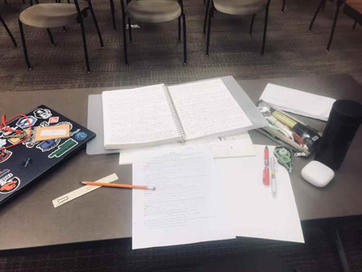

# 2025夏，我在罗斯数学营

“Think deeply about simple things.” ——The Ross Mathematics Program

谨以此文，献给我十六年来最快乐的四十天。

咖啡厅一角昏黄的灯光像是回忆的催化剂，闭上眼，脑海中便又出现了那个遥远却又触手可及的俄亥俄夏天——2025年暑假，罗斯数学营。

简单介绍一下整个申请和录取的过程吧。我在ross申请截止前一周（3.7）突然下定决心要申请，花了一个星期熬大夜甚至通宵做申请题+写文书。4.18出结果被waiting list，又在期中考试和七门AP的夹缝之间抽出了完完整整两个周末整理新的材料、重做申请题并提交。最终在5.22拿到录取。

从开始申请到收到录取，两个半月太慢却又太快。对于我焦灼的等待来说，似乎太慢了，可真到了要出发的时候，我却又感觉有些快了——我真的做好准备了吗……？
我来自北京某公立高中国际部，小学和初中都是在体制内的学校。这其实是我第一次去美国。落地旧金山机场转机的那一刻我甚至，虽然任何时候在任何人看来都十分荒诞地，生出了一丝“后悔”——如果没有被录取就好了。是的，我太紧张了，我的英语不算很好，在ross更是只能垫底了。我能和别人正常交流吗？会不会被嫌弃英语太差了？我没怎么接触过数学竞赛，平时也是以计算机和应用数学为主，我的数学能跟上吗？…

好吧，不过既然来都来了，那就暂且不想那么多了，我算好时差，在旧金山飞往哥伦布的飞机上好好睡了一觉。

早晨六点，飞机抵达哥伦布机场。一个举着ross“牌子”（实际上是一张A4纸）的学长来接我们去到camp。这时候我还不知道，来接我的这个学长会成为我的counselor——他绝对是最好的counselor（和一个非常好的朋友！）。

下午两三点，收拾完宿舍，我去拿了set 0（ross的“第一个set”）。ross的主题是抽象代数和数论，属于纯数领域。毫无疑问，纯数对我，一个大多数时间都focus on计算机和应用数学的学生来说，是非常有吸引力但同时也充满挑战的——看完set 0之后我感觉我整个人好像都皱成了一团，太多新鲜的概念了，70%的概念和符号我甚至从来没有见过——但我好像更期待了。

我的室友来的比较晚，我在discord（有些紧张地）和她说，我的英语可能不是很好，她非常开朗地告诉我哦这没有关系，正好我可以练习我的英语，她也很想练一练她的中文，这在当时很大地缓解了我的“语言焦虑”——后来我发现，ross的每个人都像她一样好，四十多天的时间我和别人几乎没有什么沟通障碍，更让我开心的是我发现我的口语似乎变好了。

（ross的宿舍!! 或许是最整洁的一张照片了，哈哈哈~）

Orientation（迎新会）安排在了晚上七点，每个人都被分到了一个family。family通常由一个counselor，一个junior counselor和三到四个first year组成。

（我的family！在给counselor过生日）

分完family之后counselor就开始带着我们熟悉set了！和很多夏校不同，我认为在ross，sets > lecture。ross的lecture不是传统的“上课”，它更像是围绕某个主题的“开放式探讨”，lecture会给你很多insightful的思路和idea，但是如果想要实打实地继续深入，那就要看sets了。

ross sets的结构很有规律，基本上由exploration、numerical和podasip三部分组成。前两个部分是对抽象代数中一些有趣规律的探索和计算；第三个部分podasip，全称prove or disprove and salvage if possible，实际上就是给出一个命题，我们需要判断这个命题是否正确，如果认为它正确，那就证明它（prove）；否则就找出一个反例来证伪它（disprove），并自己尝试修改这个命题，修改成你认为正确的样子，然后证明这个新的命题（salvage if possible）。

我还记得第一天下午我对着axiom set，第一个证明是“deduce 0≠1”（我本来以为这道证明只是社交媒体上大家开的玩笑，没想到ross真的有这道证明！）。这道题是counselor带着我们做的，最终的结论让所有人想不到——这个命题是错的，在Z_2中0=1（不过在其他的Z_m中0≠1）。

0=1？！这么荒诞的结论是怎么证明出来的？

Well，其实证明的过程并不复杂，甚至几行就可以写下。因为在axiom set我们什么都没有，只有七条环论公理，所有的证明都需要且只能从这七条公理出发。

 
不过我觉得，这个证明背后更关键的一点是（or，想要理解这个证明的前提是），在抽象代数中，“数字”都不再是我们在日常生活中所理解的“数值”（或者说某个“具体的对象”）了。相反，“数字”代表了一种关系，比如说数字2在Z_5中代表的是“三分之一”这个关系（而不仅仅是我们平常所理解的数字2），因为2×3的结果在Z_5中是1。

同理，0和1在Z_2中“相等”，也是指它们在“代表的关系”上的相等，可以从环论七条公理中的zero和one推导出来。可以说，抽象代数并不太关心“数值本身”，它关心的是“关系”。

当然，这么说或许太“抽象”了，我也是到了第二周才逐渐有了这样的感受。自己从公理开始证明一遍的确会让很多事情变得不一样。

让我印象很深的还有一道证明，也是axiom set里的。Podasip: if ab=ac, a≠0, then b=c。这个命题是我们family三个first year聚在一起讨论的，我们花了至少一个多小时在这道题上（我们都认为它是正确的，并且我当时认为“任何一个学过小学数学的人都会认为它是正确的”），直到我们的counselor进来问了一句：这个命题在Z_6上成立吗？

我坐在另外两个同学的对面，我想我们都在彼此的眼睛里看到了震惊。一切顿时豁然开朗。（答案是不成立，在Z_6中，2×2=2×5=4，但显然2≠5）

这是我在ross获得的前两个“冲击”，在之后的四十天中我还会获得很多很多个这样的“冲击”。Ross的motto“Think deeply about simple things”在这些冲击中体现的淋漓尽致。我往往会在得知答案的那一刻震惊“这么显然！”，然后感叹于自己“竟然没有发现这种显然“！

那天晚上我熬夜写完了axiom set。我到现在依然记得当我的counselor告诉我“your axiom set is very impressive!”的时候我有多么开心，我从二层蹦到三层，又从三层的lounge蹦到宿舍。我好像没那么担心自己能不能跟得上了。

（其实应该是美东时间6.17的17:28）

可能会有人很疑惑——我们为什么要考虑Z_2和Z_6呢？这是在“钻牛角尖”吗？

当然不是，虽然我一开始也没有理解为什么我们要考虑这么多不同的代数系统。不过我想我现在可以尝试着给出一个解释，不一定准确，但是我认为是一个角度。

我们的确有很多不同的代数系统，但它们之间也存在一些共同特征，群环域各自的公理其实就是这种“共同特征”的反映/提炼。换言之，我们的关注点从“每个代数系统具体的内容”转向了“代数系统间相似的结构”。如果我们能从这些“共同特征”或者说公理出发去证明一些结论，那么这些结论就是在所有符合这些公理的代数结构上普适的。而显然，数学追求一般化。我们从小学到高中所学习的“数字”，说得更准确一点叫代数系统（Z/Q/R/C），也不过就是抽象代数体系下的某个特例而已。

说来也好玩，sets中exploration部分会有不少“具体的代数系统”，不过podasip部分则几乎都是一般化的证明。

其实还有个很有趣的finding：前面sets中的exploration有可能会成为后面sets中的podasip，也就是说我们需要证明自己曾经发现（且当时认为“这怎么可能能够证明？”）的规律。比如，在set 1中有一道exploration是“for each element of U_5, list its powers and find its order. Do the same for U_6 to U_11. Now look for patterns and make conjectures!”。我觉得这道exploration是想让我们尝试发现群U_m中各个元素的阶和这个U_m的cardinality（U_m包含的元素个数）之间的关系。当然这是后来的想法了，我碰到这道题的时候是ross的第三天，我给出了一个被当时的自己看作“这怎么可能是对的”的猜想。不过神奇的是，随着sets的进展，我越来越感觉我当初的“猜想”，或者说找到的规律，似乎是有道理的。最终，好巧不巧，在第十多个sets，我碰到了这样一道podasip，证明了自己最初发现的规律和给出的猜想——U_m中每个element的order都是U_m的cardinality（U_m的order）的factor。

开心、激动、成就感……虽然已经经过了十多个sets的铺垫，但最后证明那个命题依然花了我很久时间（set 12及之后感觉每个sets都不容易做了…）。这种感觉就像盖房子，盖到十几层的我站在高处向下望，模模糊糊地又看到了徘徊在“地面上”，手里拿着草图，满脸写着“这不可能”的自己。

当然还有另一个例子。在set 14，一道exploration让我们尝试构造一个四元域（construct a field of 4 elements），并探索一下对于哪些数字m，我们可以构造出一个包含m个元素的有限域。这道exploration在后面变成了一道podasip（应该是在第二十个set左右？），最终的结论是对于所有可以被表示成某个质数的n次方的数字m，我们都可以构造出包含m个元素的有限域。不过比较遗憾的是我没有做到第二十个set，如果明年我有幸回到ross成为junior counselor的话，我想我会尝试完成全部27个sets的！

不过，注意这里的定义（ross很看重definition，哈哈哈）。ross不是“做题”夏校，这里没有传统的“题”——这里只会让你自己证明一切——我从来也只会说“做set”而不是“做题”。如果让我用一句话概括我们在ross干什么的话，我会说，我们在ross“重新发明数学”（re-invent math）。

是的，重新“发明”数学，重新走过所有证明的路。在去ross之前，我永远不会理解为什么要证明0不等于1这种“显而易见到毫无意义”的命题，我也不可能想到“if ab=ac, a≠0, then b=c”这句话并不是在所有时候都成立的，我更是绝对不敢相信自己能够从最初的七条环论公理出发，从定义“整除”开始，一步步证明很多很多个经典的结论——比如所有ross人都知道的“ross三大里程碑”：UFT、U_p cyclic和最终的QR——这个过程所塑造的我们对于抽象代数的理解是非常深刻的（毋庸置疑，如果你从头到尾自己“发明”了一个东西，你对它的理解一定会远远深于你只学习如何使用它）。我万分相信，我们在ross学习抽象代数的方式绝对，绝对，绝对是全世界最独特的。

（set 10，很难的一个set，很多大theorem的证明，写了18页！）

其实在去ross之前，因为怕去了“跟不上”，我找了个网课想先学学抽象代数，不过那除了让我记住了抽象代数里面有三个东西叫群环域和群有四条基本公理之外，没有起到太大的作用。我喜欢ross的方式，喜欢从零开始构建的世界，喜欢因为一道题抓狂一下午之后豁然开朗的感觉。我坚定地相信初学者学习抽象代数的最好方式就是做ross的sets，从axiom开始。这真的是一个全新的世界，真的会让你重新认识数学。

我想，这也是为何ross得以成为ross。

于我而言，做sets，或者说，re-invent math，自己一路证明，绝对是这个世界上最最有意思的事情。我记得我躺在地上想证明，想出来之后因为太激动直接把头撞到了床栏上；我记得某个下午towers 112开得太低的空调、终于想出来的解法和做完之后安心地躺在阳光里睡的一觉；我记得左手吃泡面右手写草稿结果在set上弄上的油；我记得在towers 115 lock in一下午只为了证明两个ring之间的isomorphism；我记得无论去哪里玩都要带上的草稿本；我记得终于花了三天18页A4纸写完set 10时的成就感；我记得各个地方凌晨两三点打在sets上的灯光；我记得每次counselor告诉我“impressive”之后的激动……

我记得那个沉浸于数学的自己，forever。

边吃泡面边想证明……很开心！

凌晨两点的towers hall，在奋战set 10…

不过，除了世界上最独特的数学之外，ross之所以成为ross，我想还有两个同等重要的原因——ross的“玩”和ross的“人”。（原谅我找不到更好的概括了，哈哈哈）

我是典型的“从小在中式教育下一路卷上来的人”，我擅长用不带空白的时间表给自己“上压力”并会在超过一定的时间（甚至不到一天）没有学习之后感到极大的焦虑（当然，我是真心地热爱计算机和数学，我甚至觉得它们是我人生意义的很大一部分，但我依然认为无时无刻不在压力自己这样的心态是很不健康的）。

ross的“玩”和ross的“人”，给“这样的我”带来的影响，和ross的数学不相伯仲。

Well，嗯，真要说“玩”，其实前四周没有太多玩的，不过每个周末会出去半天，吃火锅、玩密室逃脱、去公园等等，剩下的时间我一般还是会做set。前四周对我的改变更像是“润物细无声”的，“work hard but also need life”的理念一点点把我从中国式的内卷焦虑中拉出来，我体验了很多从来没尝试过或者因为“感觉耽误学习所以不愿意去尝试”的事情——半夜在first floor lounge和一群朋友玩真心话大冒险、花半天时间思考和（动员很多人一起）准备给counselor（不仅是counselor，也是好朋友！）的生日惊喜、凌晨两点多和很多人在宿舍里上蹿下跳（划掉）讨论上厕所的纸…、和好朋友一起什么也不干单纯地享受“泡面配奶茶”、在lounge里同时研究泡红茶和踢足球……感觉自己的心境似乎突然“开阔了许多”。我想，Ross is for math, but also for experience. My life is for CS and math, but also need experience. 对我来说，主线从来都很明确，但ross告诉我，在主线之外，有些支线也有别样的风景，只不过我曾经从来没有想过去发掘。

印象很深的是第二周的某一天，counselor说要带我们family去打匹克球。显然，作为一个典型的“不学习就焦虑“的中国式学生，我当然是不太想去了——我那天正好想写完某个set，而出去打两个小时球显然会影响我做题的进度。后来我磨蹭半天，想着带上我的set去球场吧，可我的counselor不同意：“don’t bring ur sets, u need exercise!” 于是后来我就“乖乖”打了两个小时球。虽然中间依然心系着我的证明，打完球之后“报复性熬夜”到两点（也还是没写完set），但我还是在一次次这样的过程中慢慢变得对自己不那么push，或者说不再对自己做的sets数量感到那么焦虑。我开始有意地在lock in做set之外也尝试跟大家玩到一起，和不同的人去体验不同的事情：你可以让一件事，比如sets at ross，占据你生活的90%，但最好不要是100%。

以下内容摘自我的微信朋友圈：

“……well，虽然作为一个在高中之前一直在应试教育下长大的学生，我很难不去和别人比较谁做了更多的 sets（虽然很多人都在说 focus on how much math u learned, rather than how much sets u did）。但是我觉得我也真的需要一些这样的时间，一些完全抛开 college application 的，仅仅诉诸于体验和感受的时间。TO HEAR THE REAL LIFE……”

（晚上十一点多在外面玩…）

后来，等到了第五周，lock out的氛围就渐渐多了些，再加上有些同学提前离开了camp，大家心照不宣地把自己的睡眠时间又往后调了一个小时，每天凌晨两点多都能看到有十多个同学在first floor lounge里玩Avalon（一种纸牌游戏，类似狼人杀？每个ross人的必备技能！），运气好的话早晨八点多还能遇到刚吃完早饭准备回去睡觉的counselor们（不过也有可能在凌晨两三点遇到刚打完球回来的或正准备去towers hall lock in的counselor们）。

还记得我在ross的第一周的周末，做题做到凌晨两点，当时感觉ross的生活“好疯狂”。不过等到了最后两周，别说周末，凌晨两点睡觉已经是weekday的常态了，周末一般来讲会在三点半左右睡觉，最后一周的话通常睡前都还会来一包泡面。

（哈哈哈，最后一周一直都感觉胃不太舒服，或许是因为胃里装了过多的泡面、奶茶和火锅吧（（（

也是在第五周，关于college application的lecture多了起来。虽然这些lecture从来没有提到“告诉你如何上藤校”（这不是ross的风格），但每次lecture都会在我心中强化“ross有67%的学生去了藤校”这件事。可是对我来说，这个数据是不完整的，正确的说法应该是——ross是有67%的学生去了藤校不假，可中国学生（比如我）全都在那剩下的33%里面。

于是，在这样铺天盖地的“ross的很多人最终都会去到HYPSM，除了我”的情绪的包裹下，某天晚饭我哭了——我感到了一种巨大的不公平。为什么我们和美国本土的学生付出了一样的努力，甚至我们付出了更多的努力，可我们却只能因为各种各样外界的原因而拿到“更差”的结果？

当然，我想这里的重点或许不是教育不公平——教育不公平是普遍存在的，就像清华北大在北京的录取率是在河南录取率的接近100倍一样（但这时候却很少听到北京的学生（比如我）说教育不公平），但显然人不能只在自己利益受损的时候才抱怨不公平。我也很难说清我到底是因为客观的“教育不公平”而难过，还是因为主观的“我无法去到PSM”而难过。

不过无论哪种原因主导更多，我那天确实哭得很伤心，也确实和ross的两个counselor和两个朋友聊了很久——从六点多聊到了快九点。他们的态度高度相似且明确：“好大学又不只是有HYPSM，为什么你一定要只盯着它们呢？如果真的论学术水平，这五个学校也不是相比其他学校都断档一样的存在，那么还有什么理由让你一直只盯着它们不放（并且把自己弄成这样）呢？”。唉，他们比我“有松弛感”得多，我常常感觉自己像是被申请狠狠挤成一团的海绵。

讲真，一开始我以为这只是counselor和朋友们为了安慰我才这样说的，可后来我发现他们似乎真的就是这样想的——他们真的没有把大学排名多么当回事、他们对于P/S/M也真的没有像我一样强烈的情绪（“执念”，尤其是MIT吧，哈哈哈，多年的理想）、他们更不会因为一个人的本科学校就给这个人打上先入为主的标签。
我曾经问我在ross的朋友（US citizen）想去哪所大学，她说maybe杜克，我当时有些震惊——毕竟，按照中国学生的思维，你都进ross了，你还是US citizen，你还有“女生”这个buff，那怎么也得考到HYPSM去吧。我追问她为什么，她说因为她家在北卡（北卡罗莱纳州），杜克也在那个州，会对州内的学生“友好”一些。

这不是个例。ross不少counselor都是从state school来的，他们从不像中国学生那样把这当成“不好的”，相反，他们都很喜欢自己的学校，他们也都有着很高的数学水平——完全不像一些“偏见”里讲述的那样。

甚至我自己也常常会想，许多中国家庭对那些所谓的“名校”的追捧，有多大程度是出于在做完详细的调查之后真心地认为“这所学校和我/我的孩子很契合”，而又有多大程度是出于“嗯，这所学校说出去会让我/我们家很有面子”？我想后者通常而言会大于前者吧，否则又怎么会有许多家长找机构帮孩子做题只为把孩子送进ross或sumac呢？他们看重的从来不是数学，只是ross和sumac的名声罢了。

不过转念再想，其实真正的问题在于，哪怕我已经想明白了上面的这些，我依然会沉浸在“大学排名PSM/top 5/top 10/top 20”之中，因为思想往往不能对抗本能——过度在意面子和排名，总想和身边的人竞争，也许就是中式教育带给我的“本能”吧。

不过，虽然思想不能对抗本能，但我们可以有意地去削弱这种本能，ross是一个很好的开始，对我来说。

（哈哈哈，又要开学了，不知道多久之后我又会因为申请background变得非常焦虑，不过我想我一定会记得那句“if u feel sad after u back to Beijing, just contact me.”，来自我的counselor）

不过，如果说前五周我都还有心思去想大学申请并因此感受难受，那么到了最后一周我算是完完全全抛开申请了，这一周让我难受的原因只有一个——ross要结束了。

我在第二周的时候就梦到结营，在梦里感觉很难受，不过醒了之后一想哎呀反正才第二周。可是真的等到第六周了，当倒计时的单位从“周”变成“天”了，我才发现梦里的难受可不算什么。

最后一周充满了lock out。我从倒数第三天（周三）的晚上开始就没有再做任何set，直到我周五下午离开camp。通宵的人越来越多、Avalon或各种纸牌游戏似乎在哪里都能开上一局、《学猫叫》和《小苹果》已经成了每个ross 25 camper都会的歌曲、family time的主题已经变成了哪里有好吃的和好玩的……

“最后一周，我每多做一道题，就有可能少一段友谊”——我在ross的三个best friend之一说的。

倒数第三天，有五个人决定干一件非常疯狂的事情——自己偷偷跑出去吃火锅!!

（声明：不要模仿，不要模仿，不要模仿，不提倡这种行为！）

“要带上counselor吗？”，其中一个同学问。

“哎呀都最后两天了，管那么多干什么，冲就完事了”，我和另一个同学都持有这样的观点。

于是，7.23下午六点过，towers hall的侧门出现了五个鬼鬼祟祟的身影，他们四下环顾，确定没有其他ross的人在附近之后上了一辆uber。二十多分钟后，这五个人又“凭空”出现在了火锅店门口。他们站在门口向里看了又看，害怕万一有个counselor带着ta的family在这里吃饭，不过好在没有。

这是为数不多的能在一起吃饭的机会了，没有人拘束，最后人均60美刀的账单也说明了这一点。那是我在ross最开心的一顿晚饭。真心话大冒险玩了快一个小时，虽然没问几个正经问题吧（不是））），但是整个餐厅就我们笑得最开心，我想这就是最好的回忆了。（哈哈哈，感觉这段文字写得还是太文艺了，我们都是很抽象的人哈哈哈哈哈（数学营哪有不抽象的，bushi），真心话大冒险问的问题没有一个正常的，但是好玩！有机会再一起玩！）

从火锅店出来，几个人一路唱着（跳着，哈哈哈）《学猫叫》和《小苹果》又晃悠到了奶茶店，然后又偷偷打车回到camp，还专门把终点选在了距离dorm比较远的地方，这样就不会有人发现了。

这绝对是我在ross做的最疯狂的事情，但我很开心，非常开心，非常非常开心。
当天晚上，我们又聚在towers hall，唱了半个晚上的“KTV”（well，其实只是拿电脑放音乐，然后大家一起唱），差不多凌晨两点多了才回去睡觉——好吧，其实这时候只剩下不到两天了。

对我而言，ross的友谊是极为珍贵的。在这里我们不关心对方的竞赛成绩、活动列表、有没有找升学机构……我们从来不把对方当作自己的“竞争对手”——哪怕我们处在相近的年级，未来会申请相似甚至相同的大学和专业，我们或许都会成为彼此“强劲的对手”——但我们不关心。

“竞争对手”并不是不能成为朋友，只是当我们从心底将对方认作“朋友”的那一刻开始，“竞争对手”这个身份就已经弱化到不知道哪里去了。我并不在意我们以后是否会竞争同一个大学的录取名额，我只希望我在ross的所有朋友都能过得开心，这就足够了。

我其实很少有这样的朋友。中式教育太过提倡竞争，我时常感觉人与人之间的交往已经变成了对对方申请背景的打探——可人不是那一串活动列表和标化成绩，我们异化了自己，也丢失了和别人交心的能力。不过好在，在遥远的俄亥俄，我们不需要考虑那么多。

离别自然是伤感的。欢送会从24号的晚上一直延续到了25号的下午，直到所有人离开。没什么人睡觉，也没什么人吃早饭——我拆了一袋泡面，简单吃了几口之后就搁在了一边，转而继续在朋友的setbook上签上我的名字。

从24号晚上的欢送会（甚至叫做dis-orientation，哈哈哈，或许是因为迎新会叫orientation吧）开始，空气中就弥漫着眼泪的味道——而且我想估计不少都是我贡献的。欢送会实际上到晚上十二点左右就结束了，大家基本都回了dorm和朋友呆在一起，很多人已经笑不出来了。

最早离开的一批同学是在凌晨四点左右，其中有我三个best friends之一。我们family在凌晨三点多出去开了最后一次family time，坐在campus center外面的椅子上，一切布局都未曾改变——唯一不同的只是，在第二天的凌晨三点，我已经坐在华盛顿机场了。

因为延误，我的飞机成了最晚起飞的，这对我来说“既好也不好“。好在，我可以一一送别我的三位好朋友；不过当你身边的只剩下空气的时候，你就会明白为什么不好了。

（4、3、2、1…）

我想我永远会记得在哥伦布机场遇见的那个人。她和6.15的我走在一条完全相同的路上，只不过，我们的左右方向相反——我的左边成了她的右边，我的右边却成了她的左边。是的，哥伦布机场很小，小到过了安检之后只有一条路，路的两侧就是不同的登机口。六月十五号的我是如何通过这条路走到哥伦布的，七月二十五号的她就是如何顺着这条路走回北京的——我的左边成了她的右边。

跨越四十天，我们擦肩而过，她好像在听《南山南》？我没能理解她为什么要听这样伤感的歌曲，毕竟，ross很快就要开始了，不是吗？

落地北京已经是7.27了，这之后的五天我都处于“精神恍惚”之中，我和我的三个朋友每天会发500条以上的消息。后来我开始学习SAT了，实在想不明白的题就会问他们。他们给了我很多帮助。

 
我们在整个暑假都保持着很紧密的联系，就在刚才我还告诉了他们我在写这篇文章。我们的聊天记录从七月下旬一直延续到现在，一天都没有断。

不知不觉，聊天记录上的日期已经跳到了九月，热烈的盛夏也在丝丝微凉的秋风中逐渐隐去。2025的七月走远了，但ross从未真正结束。ross的人和ross的数学，只不过换了一种方式，融进我生命的底色之中。

感谢ross。感谢ross的数学，感谢ross的人。

感谢你们，带给了我十六年来最快乐的夏天。

遇见你们，是我至高的幸运；

对于我们，我有至深的祝福。

2025的俄亥俄，永不褪色。

我们，来日方长。

终会有再见的那天。

——全文完

（已经很久没有写这么长的东西了，我其实是个很喜欢写东西的人，可惜当下总是有各种各样的“更紧急的”事情要去做……重新开始写东西的感觉真好！）