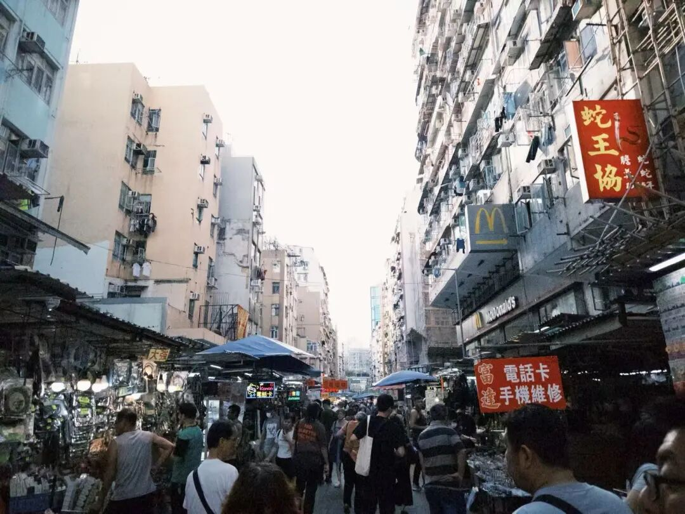
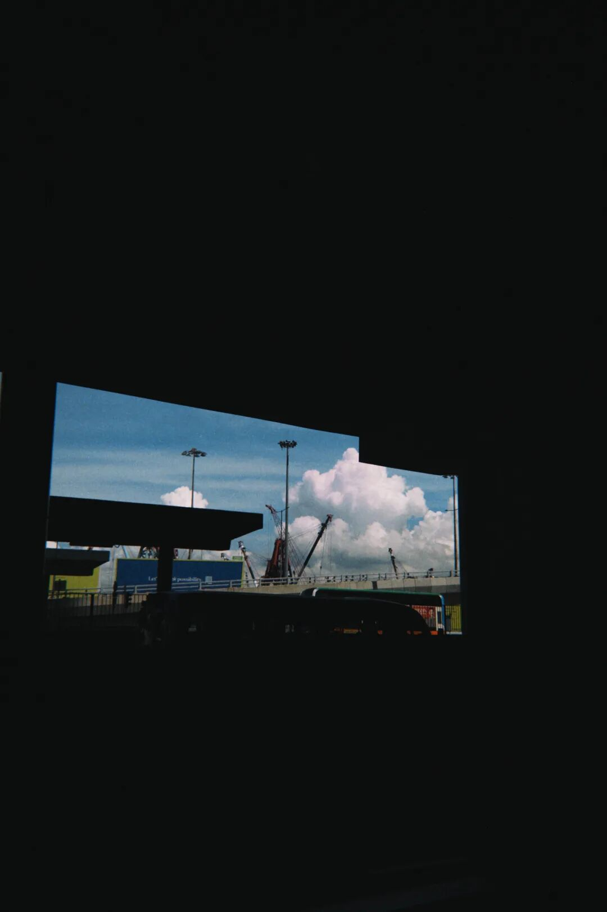
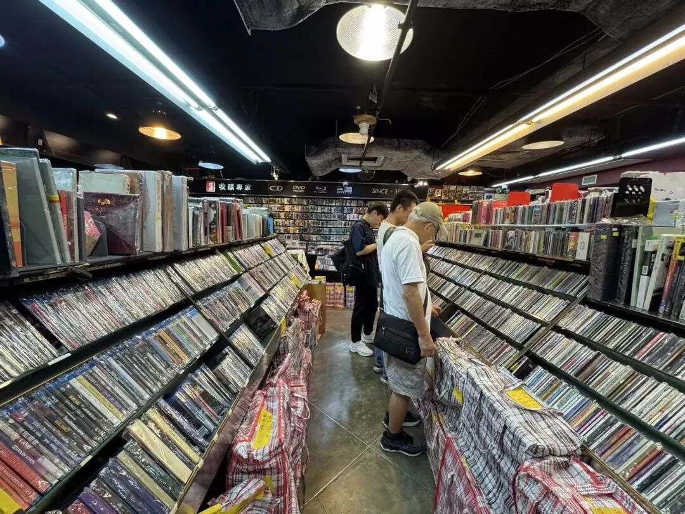
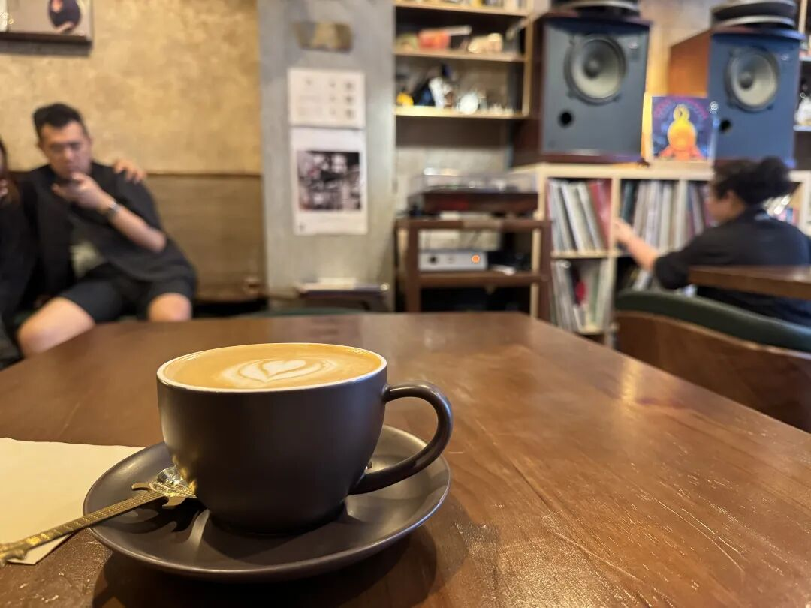
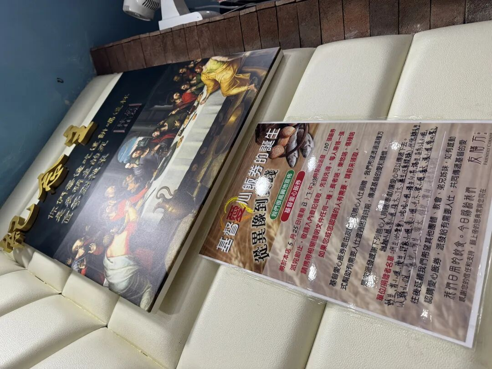
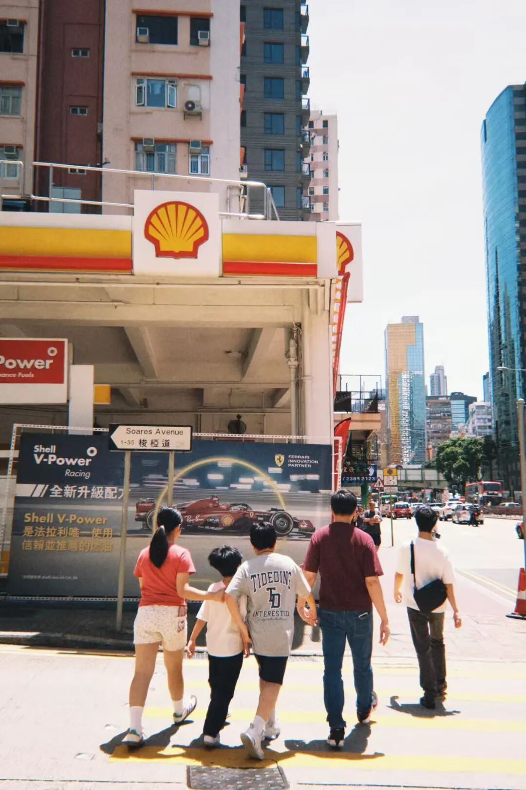
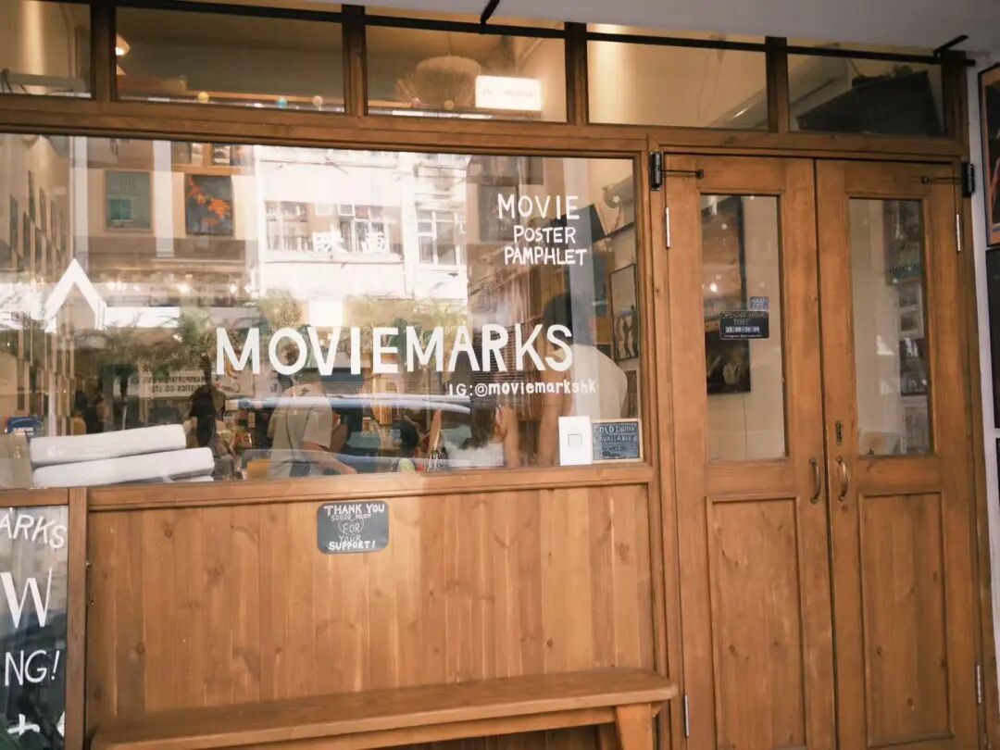
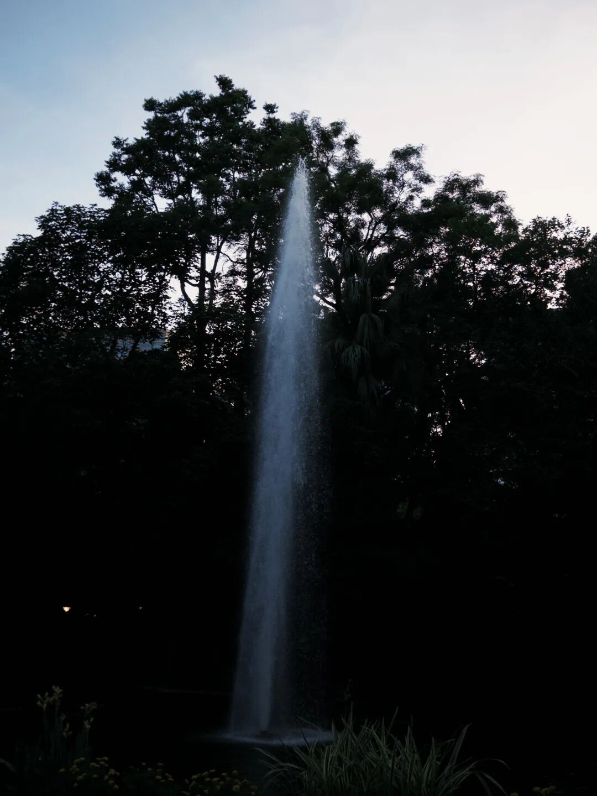

# 行 \| 香港

今年六月，因为考试来到香港，心肌炎休学的缘故，无需着急回到学校，便在此多驻足了两晚。

每去往一个城市，我都希望去探索它最市井的一面，因为我觉得只有这些地方才能真正反映出一座城市的灵魂，或者满足我对一座城市灵魂的想象，而香港的市井生活，恰恰就集中在我住的那片地方，旺角，深水埗，油麻地… 那是老区，没有香港标志性的摩天大楼和奢侈品shopping mall，只有一条条被密集老旧大厦（这里的大厦和内地指的含义不完全相同，在香港不高的楼依然可以叫大厦）夹在中间的狭窄街巷，走在街上，红绿灯的滴滴答答已经成为了香港在我脑海中最有记忆点的声音，那声音尖锐而急促，符合香港这座城市的气质，起初让我有些心烦意乱，但这声音背后实际上是为盲人做的无障碍设计，在人类文明极度发展的地方，人类的疏离和对少数群体的人文关怀同时存在着。

这两天的香港是少有的艳阳天，把整座城市照得格外鲜艳，少了几分原来在香港的赛博朋克末日风，天很蓝，云很厚，海也很蓝，可是太阳晒不走南方海港的潮湿，走进酒店总能闻到一股在北京从来闻不到独属于南方淡淡的潮湿发霉气味，洗完的内裤袜子晾了两天也干不了，走在室外很快就湿透了衣服。

考完试随朋友去了信和大厦，里面尽是卖玩偶二次元和小玩意儿的店，楼的高层有不少光碟店，每个都在大楼角落的一间，真是不懂开在这种地方是如何吸引顾客的，后来发现香港的许多店铺都是散布在大厦的高层。香港逛碟片店的人们和大陆很不一样，大部分都是中老年男性，年轻人听说话的口音反而很多都是大陆过来的，香港的老年人和大陆的老年人爱好似乎全不一样，大概生长环境不同致此。

又去了一家开在西营盘的jazz kissa，店面不大，里面摆着一对很大的JBL复古音响，我进去的时候正在播放Herbie Hancock的Head Hunters，音质不错，至少比家里那套好，看到两位店员，其中的男咖啡师大概率也是爵士乐爱好者，长发黑框眼镜，边做咖啡边哼着音响里放的曲子，可惜来了半小时就要因为晚上的演出开始清场，遂离开。

晚上阴差阳错走进一家基督教餐厅，墙上贴满了传教文字，顾客多是香港的爷爷奶奶们，我和同学一进门就被围观，因为我们的存在实在显得新奇和格格不入，好在这种围观是完全善意的，旁边的爷爷还为我清出一个位置坐下。

心肌炎之后睡眠质量一直不如从前，换了环境后睡得就更不踏实，前两个晚上都在床上辗转反侧迟迟不能入睡，渐渐进入一种焦躁的状态，晚上睡不好，白天就很累，心脏也一直处在亚正常状态，时常感觉阵阵疼痛，甚至到了最后一天下午出现了胸闷气短的情况。

身体的亚健康状态让心理也处在警惕和焦躁当中，当身体在不断提醒我自己的存在的时候，就很难沉浸在旅行的体验当中，第二天睡到了很晚，然后在酒店里赶一些拖延导致一直没完成的工作，一方面工作不得不做，另一方面这样可以摆脱一起出行的同学，我总是喜欢一个人旅行，因为更加随心所欲，也更容易和外界产生互动。

第二天下午才从酒店出门，在地图上标记了所有想去的地点，发现正好连成了一条线，而我的酒店就大概在线的中间，大部分时间都在走路，如果实在太远，就坐一两站地铁，去了两家书店，去了两家唱片店，去了电影海报店和百老汇电影中心，最后在九龙公园落脚，虽然有些许反感在小红书上看旅行攻略，每次依然逃脱不了，大部分地方都是从小红书得知，少部分是孤独星球的推荐。

来到任何一个地方，都少不了当地的书店，唱片店，和电影院走走看看。在书店，除了书是繁体版的，许多内容和大陆书店并无二致，在全球化的今天，属于世界的经典和畅销似乎在哪里都是差不多的，哲学有加缪萨特，文学有村上春树卡夫卡，永远都被摆在书店最显眼的位置，如果说和大陆不一样的地方，大概是有更多关于本地事务的书籍。

因为众所周知却不允许被言说的原因，近年来香港的政治活动空间被不断压缩，我第一次来香港似乎是这一系列变动的开端，到了如今，许多的公共表达已经不被允许进行。我却依然在城市的一些角落窥见了这些表达存在或者曾经存在的痕迹，在通往序言书店楼层的电梯里，有各种涂鸦和贴纸，有的是说广东人是二等公民的hate speech，也有的是提醒人们不要忘记某些历史的标语，在言论自由的社会中，它们同时存在，在言论自由的反面，hate speech会被消失，公共良知也会被隐匿。

因为MLA的那首在九龙公园的游泳池，我在傍晚来到了九龙公园，听说是同志的聚集地，我却没有发现什么迹象，倒是地上坐着成片的东南亚人铺着底垫坐在地下聊天，吃夜餐；因为心脏已经感到不适，我并没有怎么逛公园，而是找了个长椅坐下，我看到一个黑人男子正在独自坐在长椅上喝啤酒，旁边还有个位置，我就问他“can i sit here?” 他用中文回答“请坐”。坐下后，我一直拿着手机回复各种信息，他拿着酒瓶贴在自己的脸上看着前方，似乎在想事儿，也可能只是在发呆，当我闲下来后，做了不少时间的心理建设，才主动和他搭话攀谈起来；他来自卢森堡，学了三年中文，前三个月在台湾，这是在香港的第二天，他最想去的地方是北京，试图找份工作。当两个拿着旅行册子的法国人从我们面前走过，他说“you know, i don’t like french people, generally white people, they feel proud.” 他后来又对白人的文化，白人的殖民史发表了强烈的不满，最后还说”don’t fool by the saying of white people about democracy, democracy is definitely good, but look at India, it’s a bunch of mess.” 他说的话有多少实事依据在我看来存疑，但是作为两个非白人的个体，我们许多对西方中心主义的经验是共通的，社会中无处不在的white superiority在制度平等的当下并没有消失，结构性的不平等更容易被主导的话语所合理化，更不容易被发现。

或许是我比较不敏感，或许是我运气比较好，从来没有因为说普通话被歧视的经历，很多人觉得说英语会得到更好的态度，有时我也说英语，却完全没有这样的感受，相反我得到了许多友善，唱片店的老板帮我解决了许久都没有解决的唱片机问题，最后一天博物馆开导览车的大叔分外热情地用塑料普通话和我们谈天说地，在这个高度发达的资本主义社会，在这个社会矛盾和割裂的社会，依然存在着不少人味儿。