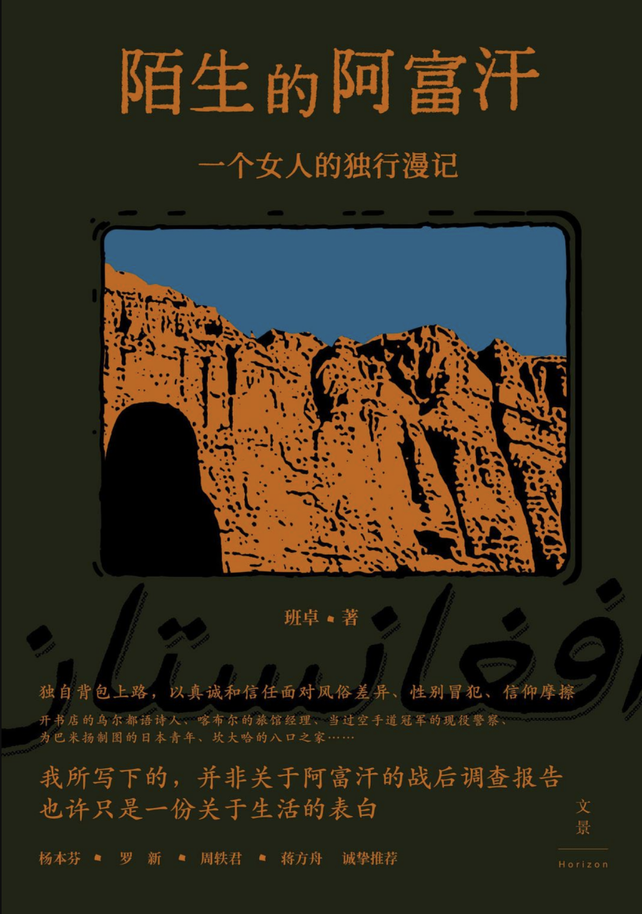

# 读书笔记 --- 陌生的阿富汗

*我们的连结建立在一个人类和另一个人类的理解和共情，这种情感根植于本性，不被任何的社会结构所动摇。*

在社区图书馆里随便翻到的书，却成为了近期看过最好看的文字，作者用最质朴的文字描绘下人与人超越言表情感联结，她在文章中反思的许多问题，也是正在困扰我的问题：人为何反而对亲近的人不能做到坦诚？在这个残酷的世界里，善良作为一种特权，它的界限在何处？既然最终走向安定，漂泊的意义是什么？

看游记我其实对景观并不怎么感兴趣，生活在那片蓝天下的人才是我真正迫切想要了解的，而作者似乎在这点上与我相似，她的文章也都把重心放在了人，而景只是点缀和背景描写。

作者笔下的每个人都是真实且鲜活的，她既没有浪漫化尚未被资本主义“污染”的人们的纯洁善良—— 作者作为一个女性，在这个极端宗教保守的国度中，饱受着显性和隐形的歧视，甚至随时都要担心自己的人身安全；但同时她也毫不吝啬地写出了每个人心中的了良善和生命力，尽管作者和他们的文化和生活背景都截然不同，以至于他们永远无法理解作者的许多行为，但他们还是保持着对一个人的尊重，热忱，和善良，尽管他们生活在饱受战争摧残的国度，却依然相信未来的世界会变好。

游记写于约二十年前，如今塔利班再度统治阿富汗，不知这些远方的人们可依然安好。

我敬佩作者的勇气，我若是一个女性，绝不敢在这样危险的国度游历四方，我敬佩作者的善良，她总是会用最大的善意理解他人，我敬佩作者的思考，她把许多徘徊在我脑中却尚未成型的疑惑表达了出来

这些日子我总是不知如何和所谓相比自己更加低社会阶层的人相处，我总是害怕自己的存在会带给他们压力，我害怕我对他们做的事是一种剥削，从作者与阿富汗人的相处中，这个问题部分得到了解答，我从她的文字中看到了她对这些人完全的平等和尊重，而不是一种上层对底层的伪善的同情，她并不把他们看作穷人，看作难民，看作阿富汗人，而仅仅是人，因此不管我们在各个方面多么不同，我们的连结建立在一个人类和另一个人类的理解和共情，这种情感根植于本性，不被任何的社会结构所动摇。

