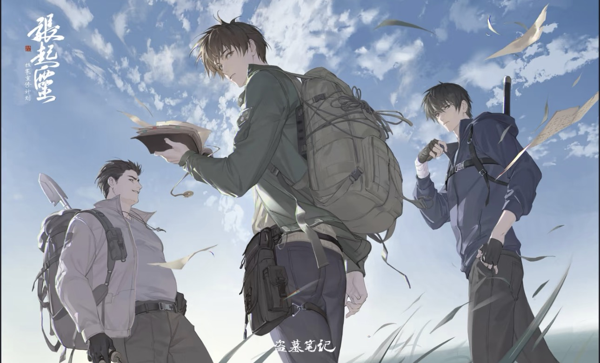
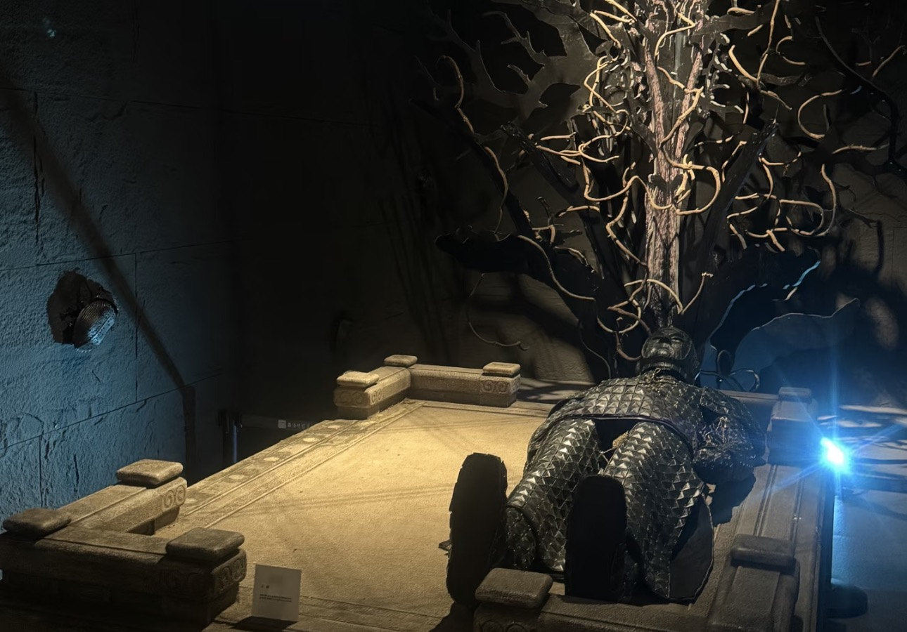

# 从《盗墓笔记》到考古学

当我偶然间在书店瞥见了那本《盗墓笔记》，它的封面散发着神秘的气息，仿佛在无声地召唤着我，我翻开第一页，便一头扎进了吴邪、张起灵和胖子的冒险世界。

书中的古墓仿佛一座未知的迷宫，充满了未知的危险与惊喜。七星鲁王宫中，神秘的七星疑棺、恐怖的九头蛇柏以及青眼狐尸，深深吸引着我；秦岭神树里，巨大的青铜树以及远古巨兽烛九阴，让我对那个神秘的地下世界充满了好奇与敬畏；云顶天宫中，万奴王的神秘传说、巨大的青铜门以及阴兵借道，又为故事增添了一抹神秘而又庄重的色彩，当闷油瓶跟随阴兵走进青铜门的那一刻，我的心也仿佛被一只无形的手紧紧揪住，充满了担忧与不舍。这些惊险刺激的情节，如同一场场精彩绝伦的电影在我脑海中不断放映，让我对古墓产生了强烈的好奇，也让我对那些隐藏在历史长河中的秘密充满了探索的渴望。

随着阅读的深入，《盗墓笔记》中那些神秘的古墓、珍贵的文物以及隐藏在背后的历史故事，像磁石一般紧紧吸引着我。我开始不满足于仅仅在书中感受这份神秘，于是，我踏上了主动探索的道路。我在网上查阅与那些历史故事、古墓和文物相关的资料了解到，三星堆出土的青铜神树与书中的秦岭神树相似；鲁王墓中的玉俑是藏于河北省文物研究所的汉代金缕玉衣；最神秘的蛇眉铜鱼是以中国国家博物馆的玉龙为原型；书中建立云顶天宫的东夏国正是历史课本中讲到的女真族。每找到一篇相关文章，每观看一个视频，都像是在黑暗中找到了一丝曙光，让我对那个神秘的世界有了更多的了解。在这个过程中，我第一次听说了“考古学”这个名词，知道了原来有这样一群人，他们以科学的方法探索古代文明的遗迹，解读历史的密码。

起初，我对考古学的认识充满了误解，就像大多数人一样，我以为考古就是像书中那样，进入古墓寻找宝藏，并且有着神秘的口诀。但随着了解的深入，我才发现它是一门严谨的科学，通过对古代遗迹、遗物的研究，揭示人类社会的发展历程和文化传承。那些在盗墓小说中被一笔带过的历史背景、文化习俗，在考古学中都有着深入的研究和解读。这份误解并没有减少我对考古学的向往，反而让我更加渴望去了解它的真实面貌。我开始想象自己有一天也能像真正的考古学家一样，穿上专业的服装，手持工具，在古老的土地上探寻历史的痕迹。这种向往如同星星之火，在我心中迅速燎原，让我对未来的方向有了新的思考。

考古是一门充满使命感和责任感的科学事业，它承载着揭示历史真相、传承人类文明的重任。考古学家们怀着对历史的敬畏之心，运用先进的科学技术和严谨的研究方法，对古墓进行系统、全面的发掘。在发掘过程中，他们会小心翼翼地清理每一层土壤，仔细记录每一个发现，不放过任何一个细节。对于出土的文物，他们会进行专业的保护和修复，力求还原其本来面貌，以便更好地研究和展示。考古学的研究范围极为广泛，从古老的城市遗址到神秘的墓葬，从精美的文物到质朴的生活用品，从古代人类的生活方式到社会组织结构，每一个方面都蕴含着无尽的奥秘。它就像一把神奇的钥匙，能够打开历史的大门，让我们穿越时空，与古人进行一场跨越千年的对话。

考古学家们就像是一群神秘的侦探，从那些看似平凡的遗迹和遗物中寻找线索，一步步揭开历史的谜团。每一个新的发现，都可能改写我们对过去的认知，每一次考古发掘，都像是一场激动人心的冒险，充满了未知与惊喜。无数重大的考古发现如璀璨星辰，照亮了我们对过去的认知之路。周口店北京人遗址的发现，将人类的历史向前推进了数十万年，让我们对人类的起源和演化有了更深刻的认识；敦煌莫高窟的发现，宛如一座艺术的宝库，里面精美的壁画和雕塑，展现了古代佛教艺术的辉煌，也为我们研究古代文化、宗教、艺术等提供了珍贵的资料；秦始皇陵兵马俑的出土，更是震惊了世界，那规模宏大的军阵，栩栩如生的陶俑，让我们仿佛看到了当年秦始皇横扫六国的雄姿，也为我们研究秦朝的军事、政治、文化等方面提供了丰富的实物证据。这些考古发现，不仅丰富了我们的历史知识，更让我们对人类文明的发展有了更全面、更深入的理解。

对考古学了解得越多，我心中那颗热爱的种子就越发茁壮成长。我迫不及待地想要将这份热爱转化为实际行动，于是，我积极参加学校有关历史的选修课和活动。在那里，我们一起探讨人类历史的奥秘，分享彼此的见解和发现。除了参加活动，我还利用课余时间阅读了有关文物和考古学的书籍，如《中国考古学通论》《墓葬卷》等，这些书籍让我对考古学有了更深入的了解，也让我对考古学家们的工作有了更深刻的认识。每一本书都像是一位智慧的导师，引领我在考古学的知识海洋中遨游，让我不断汲取新的知识和营养。

在未来的日子里，我希望能够进入一所优秀的大学，学习考古学专业，接受系统、专业的教育和训练。我渴望有一天，自己也能成为一名真正的考古学家，参与到那些激动人心的考古发掘项目中，亲手揭开历史的神秘面纱。我希望能够用自己的双手，挖掘出那些沉睡在地下的文物，让它们重见天日，为我们讲述古代文明的辉煌与沧桑。考古学，它不仅仅是一门学科，更是连接过去与现在的桥梁，是一场永无止境的探索之旅。走进这个神秘而又充满魅力的世界，感受历史的厚重与文化的传承。

