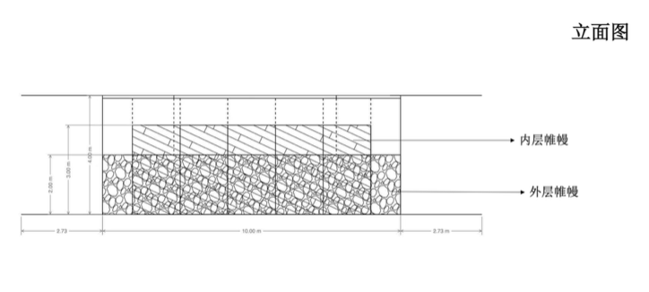
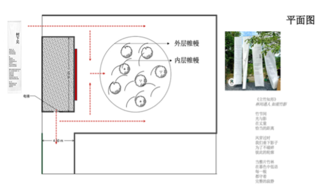

# 冥想社经历

冥想社的发展从建立至今，可以说是道路崎岖。

传统意义上的道路崎岖，人们总认为是朝着一成不变的目标的不懈追求，在这过程中克服懒惰，克服困难。可是，在经历了属于冥想社的道路崎岖之后，我意识到一成不变的道路只存在于理想之中，现实之中是不可能在不改变目标的情况下无限地前进的。回想最初建社时的激动，我们曾以为只要坚持就一定能抵达终点，可现实却让我们早早学会了灵活转向。

没有人有预知未来的能力，因此冥想社在初期只能设定一个较为理想化的目标以便后来再根据实际情况进行改进。这个目标像一张粗略的草图，留足了空间给我们边走边修改。 从九月下旬开始，我们试图申请一间独属于我们的教室，将其改造成一个永久的冥想室，让同学以及老师以自助的方式进行冥想。不幸的是，尽管完成了多版企划书的撰写，学校仍因空闲教室紧缺为由驳回了我们的企划。这一刻，我们最初的热情仿佛被浇了一盆冷水，我与金力感到深深的失落和无力，甚至开始质疑社团存在的意义。 但正是这种打击，让我们被迫停下来反思：固定空间虽好，却并非传播冥想的唯一途径，它只是我们初心的一种形式，而非本质。那一晚，我们几个人坐在空荡荡的走廊上，第一次把“冥想”从一个房间的概念，剥离成更本质的心灵实践。

于此，我们只能变化我们的目标。在胡捷老师的建议下，我们打算另辟蹊径在一楼舞蹈教室的旁边建一个又帷幔组成的冥想空间。不一定是出于无奈之举，也不一定是心态上的转变，我只能将此次由实用性到艺术性的改革称之为战略变动。这种变动让我们重新燃起希望，也第一次尝试把冥想和艺术结合在一起。 有了前进目标，我们很快就走出了失落和无力，在专业设计师的指导下开始了冥想艺术装置的设计。首先，我们确认了我们艺术装置的中心立意：立竹知形。立竹知形描绘了一幅当代社会的写意画卷：我们如同共生于一片广袤竹林，风姿各异，并肩而立。 我们得以窥见彼此的轮廓，却难辨他人生活的真实纹理与情感的全貌。这种“影影绰绰”的距离，并非疏离，而是一种必要的边界与呼吸感。这个立意其实来自我们对校园日常的细心观察：大家看似近在咫尺，却常常被无形的墙隔开。 确定了立意之后，我们用设计来尽可能地模拟出竹林的意境：用两米高的矮层帷幔框出范围；用4米高的悬挂的高层帷幔框出个人的范围；地面用仿生地毯点缀。于是，多层的帷幔形成了影影绰绰的效果，确切地表达出了艺术价值，而实用性（隔音，遮光，独立空间）也难免地大打折扣。理想是丰满的，现实是骨感的，学校依旧因担忧其“可实施性”驳回了此提案……冥想社再次丧失了目标。那一刻的沉默比第一次更沉重，大家都明白，单靠创意还不足以落地。

以下是俯视图以及立面图：

   
如今，我们冥想社找到了一个新的暂时的目标：举办每周例行的冥想活动，邀请学生以及老师参加不同主题的冥想。为了最大化用户的体验，我们申请了舞蹈教室的使用权，为参与人员准备袜套，茶水，香薰等物品，利用蜡烛，音乐带领大家进行约15分钟的冥想。借此机会，冥想社希望积累群众的意见以及自身的经验，以便以后能进一步地发展北中冥想活动。但要切记，这仅仅只是暂时的，还有一些问题例如冥想活动的收费，宣传，影响力扩张仍需要仔细考虑，并且我们冥想社一直在尽力获得教室的永久使用权，让学生老师能够随时随地的有地方冥想。更重要的是，看似矛盾，目标在变，初心不变，冥想社不管是出于实用考虑还是艺术考虑，都是为了让人们关注当代社会人们的心理健康并思考人与人之间的距离……尤其是在经济下行，戾气遍布于四地的时代。

道阻且长，行则将至……冥想社将会一直为社会心理健康而努力。