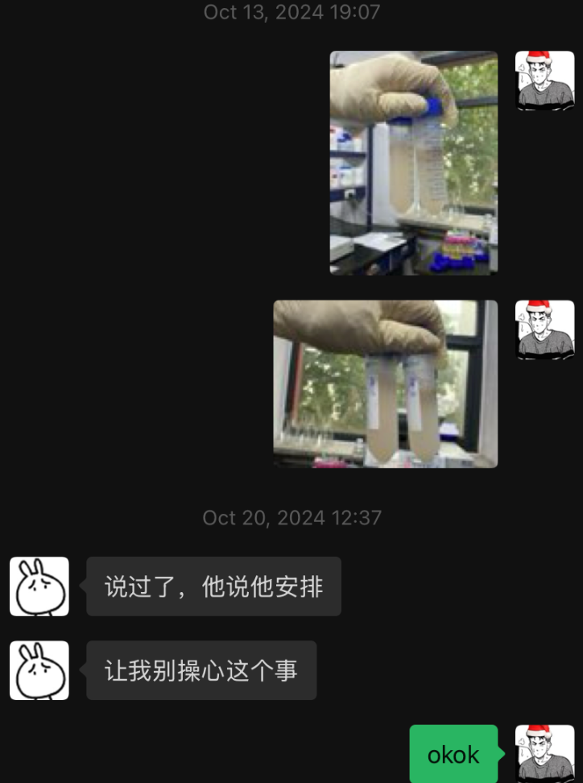
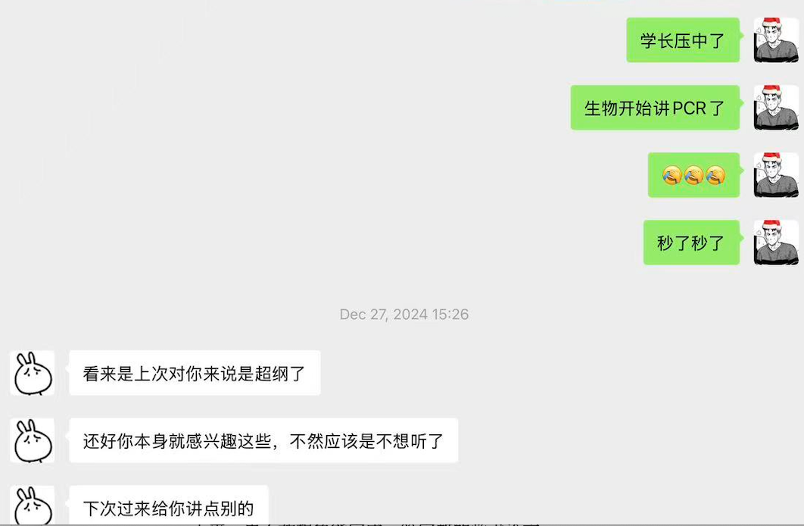

# 躺平青年的第一次科研

科研之路，道阻且长。

“在癌症免疫治疗领域，重组人白细胞介素-2（rhIL-2）作为一种关键细胞因子，具有激活T细胞、增强免疫应答的重要功能。然而，其在传统大肠杆菌表达系统中极易形成包涵体，导致蛋白不可溶、活性丧失，严重制约了其研究与临床应用。我的研究正是围绕这一痛点展开——通过构建His-MBP融合系统，在优化的大肠杆菌Origami B(DE3)菌株中实现rhIL-2的高效可溶表达与纯化，并最终获得具有完整生物活性的蛋白。该工作不仅为rhIL-2的规模化制备提供了一种稳定、经济的新策略，也为后续的免疫治疗研究奠定了物质基础。”

这段话是对我这次中科院科研的总结，放在两年前，我可能（肯定）啥也看不懂。九年级的我缺失的不只是脑子，还有对未来的方向感。所以带着这些美好的缺点，我踏上了我未曾意识到有多大冲击力的科研征程。

回首这段持续一年多的科研之旅，它始于2024年盛夏。那时的我，还只是一个对生物学充满好奇、却对“科研”二字仅停留在课本认知的高中生。在学校的推荐下，我有幸进入中国科学院某研究所开展课题研究。最初面对“载体构建”“融合蛋白”“色谱纯化”这些陌生术语时，我感到的不仅是兴奋，更多的是茫然与自我怀疑。我不知道自己能否在实验室里坚持下来，更不敢想象能完成一篇完整的学术论文。

幸运的是，我遇到了两位至关重要的引路人。

李昭华老师是我的理论导师。从课题立意、技术路线设计，到论文写作与修改，李老师始终以严谨而包容的态度引导我。他从不直接给我答案，而是不断追问，在这种苏格拉底式的启发下，我逐渐学会了如何提出科学问题、如何批判性地分析数据、如何将零散的实验片段串联成一个逻辑完整的故事。如果说李老师为我搭建了研究的骨架，那么文扬学长则是那个手把手带我走进实验室血肉世界的人。作为已在实验室深耕多年的老资历（电竞高手），文扬学长是我的“实操教练”。从如何正确移液、跑胶，到操作蛋白纯化系统，他总是不厌其烦地示范、纠正、再示范。我记得第一次做PCR时手忙脚乱，是他镇定地帮我排查问题陪我一起重新过柱、分析数据。在并肩作战的午后和夜晚，实验室里不止有仪器的嗡鸣，更有他清晰的讲解和我逐渐增长的信心。他让我看到，科研不仅是脑力劳动，更是细致、耐心与动手能力的结合。文扬学长其实更把我当他的朋友来看，我在刚到所里的时候习惯喊他老师，他却执着于我叫他哥，在一些实验的间隙或者休息时，他经常和我聊一些生活中的日常，也会给我讲一些他学生时代的求学经历和故事，放假时也会时常带我打打游戏，让我体验到了科研领域的人情味。

从2024年暑假的懵懂入门，到秋季开学后兼顾学业与实验的奔波，再到2025年反复修改论文、投稿与返修的过程，我经历了一次完整的科研周期。这条路并不平坦，但正是在李老师的理论指引和文扬学长的实践支持下，我一步步走了过来。我学会了阅读文献，学会了设计对照，学会了在混乱的数据中寻找规律，更学会了在压力中保持心态的平衡。

2025年底，当收到期刊录用通知的那一刻，我感受到的并非狂喜，而是一种深沉的平静与感激。我感激的不仅是这个结果，更是这个过程——它让我真正理解了何为科学探索，何为团队协作，何为坚持的意义。这段经历，早已超越了一篇论文、一个课题本身。

科研之路，道阻且长。而我很庆幸，在十七岁的夏天，我遇到了生物学，遇到了愿意为我点灯的师长，也遇到了那个在实验室里的自己。虽然生物学这座大山是险而又险，但是我至少离售票处更进了一步。

