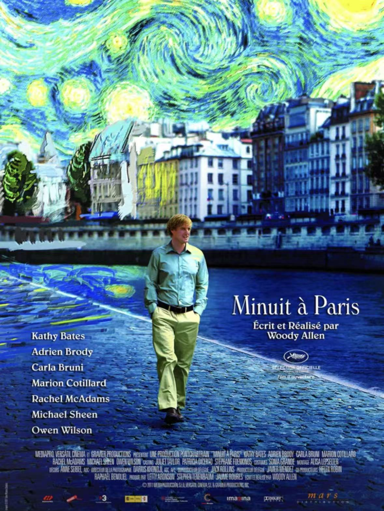

# 影｜午夜巴黎

看完午夜巴黎，感觉可以把它排到我心目中目前看过伍迪艾伦电影的第一位。保持了伍迪艾伦一贯对小布尔乔亚知识分子的讽刺的元素，这次的笑点和剧情设都更加符合我的口味。

更重要的是，我从主人公中看到了自己的影子。一个生活在零零年代却对20年代巴黎充满向往的梦想着成为小说家的好莱坞编剧。巴黎，似乎已经成为了浪漫的代名词，一切诗和远方都在这里发生；而二十年代的法国，更是被后人描述为群星闪耀时的时代。作为一个热爱幻想的作家，主人公把自己对于艺术的幻想，全部寄托在了法国，寄托在了巴黎，特别是20年代的巴黎。

如果剧情仅仅是讲主人公穿越到20年代的巴黎，度过了浪漫的，浮光掠影的一段时光，那么它便是相当平庸的。但是有趣的是，当主人公穿越到20年代的巴黎，和那些他眼中代表了那个辉煌时代的大师们交谈的时候，却发现他们也拥有和他一样怀旧的情愫。这样的剧情设计，戳破了主人公对黄金年代带有滤镜的遐想，也戳破了我许久以来各种怀旧的情愫。我们可以幻想出一个完美的世界，生活在其中的人却永远是焦虑的，不满的。

但是，对于一个该死的浪漫主义者来说，怀旧又有什么错呢？现实是苦涩的，是令人不满的，你看到社会的种种恶，唯一逃避的方法就是躲进某种幻想，我幻想我是生在中国八十年代在校园中弹着民谣充满理想主义的文艺青年（尽管他们天真地令人可笑），我幻想我是美国六十年代倡导爱与和平的嬉皮士（尽管他们吸食毒品给社会造成负担），我幻想我是法国左翼知识分子中的一员（尽管他们躲在象牙塔中不肯走向现实）。我不停怀旧，怀旧让我相信这个世界还存在美好。

就连导演本人也无法逃脱这种情愫的诱惑，他在十三邀的访谈中说到“过去的纽约是一个最有魅力的地方，路上经过一百个人，可能是华尔街精英，可能是建筑师，可能是电影制作者，可能是咖啡里的打工仔… 每一个擦肩都是丰富精彩的人生，而现在的纽约，只有富人和穷人…“ 不知道伍迪艾伦在说这段话的时候有没有想到自己在午夜巴黎中塑造的那个主人公。

人活着总要有些信念，有些人相信现实的功名利禄，有些人却相信远方真善美的存在，后者的存在是那么天真可爱，伍迪艾伦，你又是怎么忍心戳破他们那如今早已不被待见的遐想呢？

