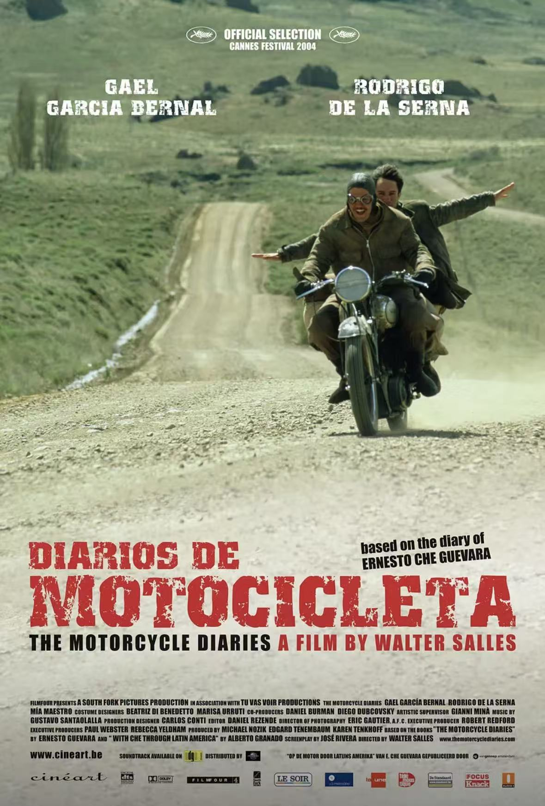

# 影｜摩托日记

看这部电影之前并不知道讲的是切格瓦拉，因此在电影的前半段我一直认为这将是一部典型的中产阶级公路电影：即将成为社会精英的年轻人踏上一段嬉皮士式的旅行，在路上反思社会带给他们的规训，产生的思考最后让他们选择过上不一样的生活。

但是电影的重心从两个主角遇到信仰共产主义的原住民夫妇开始发生了偏转，他们都被夫妇的处境所触动，反观他们自己的旅途的目的是多么单纯又有些可笑：为了上路而上路。豆瓣有个短评很简单但精髓：从文青变成左倾。影片的后半部分有许多镜头给到了当地的佃农，原住民，描述他们在现代化和资本主义下面临的悲惨处境；充满正义感的男主看到这些景象感到无奈和悲伤，使他开始反思阶级矛盾和殖民主义，在影片的最后，我才被告知他最后成为了共产主义革命领袖——切格瓦拉。

这样的叙事从主观上打动了我，看到那些受苦的人，我不禁带入男主的视角去思考和共情这发生的一切，并不自觉得就把它带入中国的语境，同样存在影片中刻画的这样一批人——农民工们，他们为现代化做出了直接贡献，却未能和城市人共享现代化的果实。但是同时，这种以中产白人作为主体的叙事又让我对电影抱有审慎的态度：它看似是对文化多元主义和人类大同价值的宣扬，实则却把那些底层阶级进行了彻底客体化，脸谱化的刻画，他们成为了白人中产阶级眼里代表苦难，代表多远文化的一种景观和一种符号，他们成为了衬托男主理想主义的工具。

观看这部影片的人大多生活背景与男主近似多于那些佃农和原住民，所以我们自然会把自己带入男主的视角，所以我们究竟是被底层人们的处境所触动，还是被自己对底层人们的同情和正义感所打动？如果让那些真正处于底层的人看这部电影，他们是否能够在这套叙事中找到自己的主体性，能在其中感到自己真正被尊重？

但我想也没必要对这部电影如此苛责，因为任何阶级都会从自己的角度出发看待其他人，并且在我看来，有时候这种生存条件和环境的迥然不同必然会让不同阶级之间很难彻底互相理解，我连身边的大部分人都无法彻底理解和共情，你又怎能要求我去从真正意义上不带有任何标签地去和与自己毫无相似之处的人去相互理解？然而回归到最原初的共同点，那便是我们都是人，从这个角度，我们尽力去尊重和爱所有人，并不由于它出自某个阶级，出自某个民族，出自哪个性别，我想这从某种程度也是电影想传达的信息。

作为一个公共话语意义上的中产阶级或者社会精英，我们拥有与生俱来的特权，而当意识到这种特权意味着对别的阶级的剥削和不平等是，这种特权同时也成为了一种原罪。在你不能否认这种原罪的同时，它也是无法消解的，除非你放弃所有的特权，但这并不是“赎罪”最好的方法，因为这种结构性问题并不能因为你放弃了特权而被彻底解决，更合适的方法似乎是去利用自己的资源和特权去尝试改变这种结构，这似乎也是共产主义的先锋们想要做的是。

文艺作品究竟该如何刻画底层？在何种程度这是一种真正的人文关怀，何时这又是一种在剥夺底层话语权的情况下对他们进行的叙事霸凌？我想这取决于作者究竟有没有把ta真正当作一个人去看待，而不单单是一个阶级以及任何被异化的符号。我们作为所谓的拥有文化资本的精英又该如何去看待和欣赏这些文艺作品？我们不应该把这种对苦难叙事的欣赏当作一种时尚单品，去进一步巩固自己的文化资本，进一步巩固维持自己特权的结构，而是真正去反思这些社会现象，把思考化作真正的尊重和关怀，以及潜在去改变社会现有不公结构的动力。

