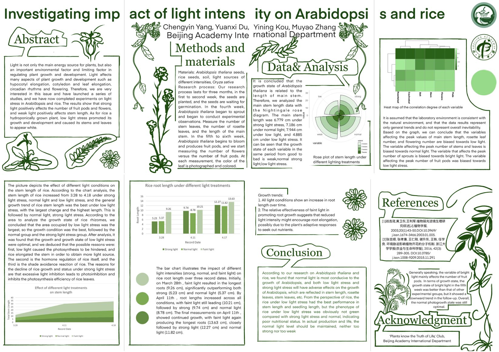
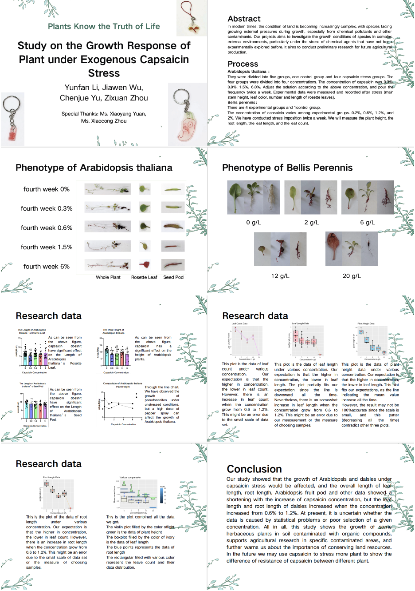
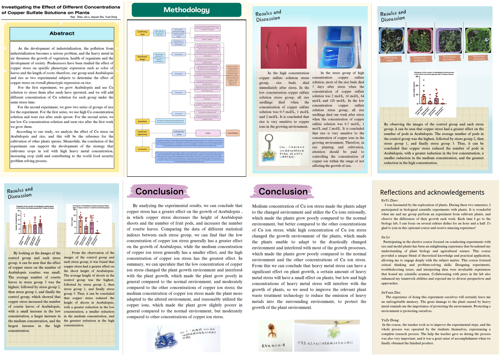

## 课程简介

《植物知道生命的答案》是一门实验性校本课程，旨在激发学生的研究兴趣，通过深度文献阅读和小组合作，引导学生自主发掘并确立研究课题。在实验环节中，学生将系统学习并掌握植物材料的培养方法、试验设计的理论与实践、生长特征的细致观察、生理特性的分析以及形态结构的解读，深入理解外界环境变化对植物生命活动的影响，科学阐释实验结果。本课程着重培养学生发现问题的敏锐性、深度思考的能力、逻辑分析的本领、相对独立的研究精神以及团队协作的默契，为学生未来在大学独立进行毕业实习、撰写毕业论文奠定坚实的实践基础。

## 2023-2024学年汇报视频

  <iframe src="//player.bilibili.com/player.html?isOutside=true&aid=112670497965546&bvid=BV1xi3jeCETW&cid=500001594784506&p=1" scrolling="no" border="0" frameborder="no" framespacing="0" allowfullscreen="true"></iframe>

## 研究课题和小组成员
### 陆战队（光照小组）：杨CY、杜YX、寇YN、张MY

### 宇宙无敌暴龙战士队（辣椒素小组）：李YF、武JW、虞CJ、周ZX

### 硫酸铜小组：赵KY、李J、朱JY、董YZ

## 选修课相关的热缩片