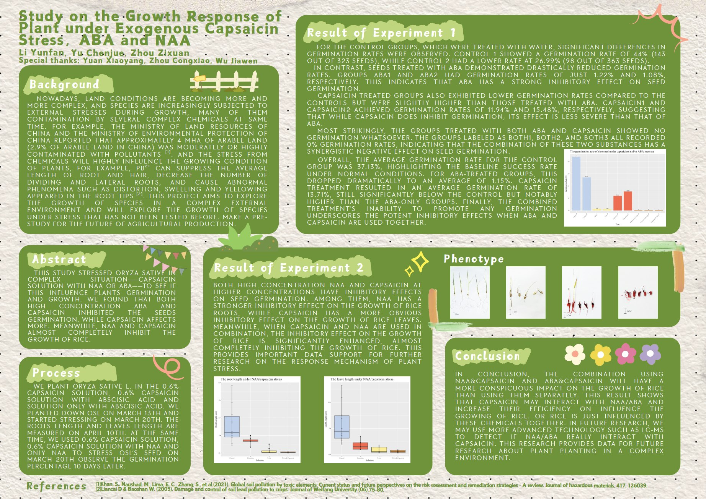
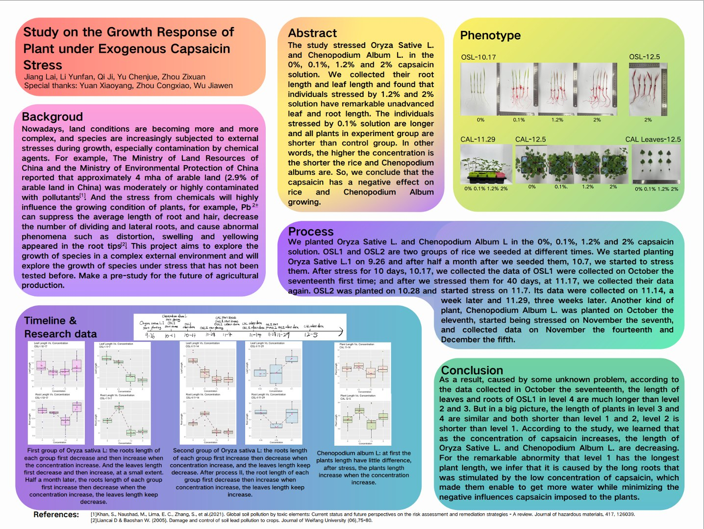
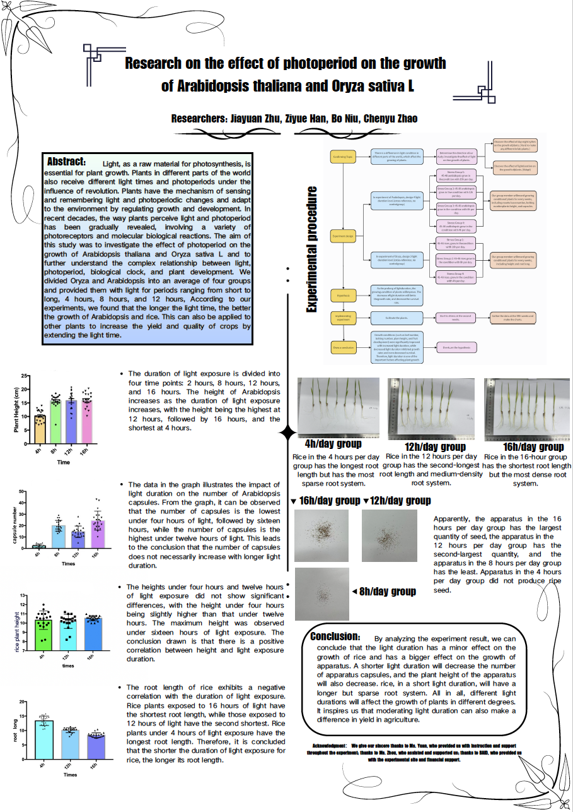
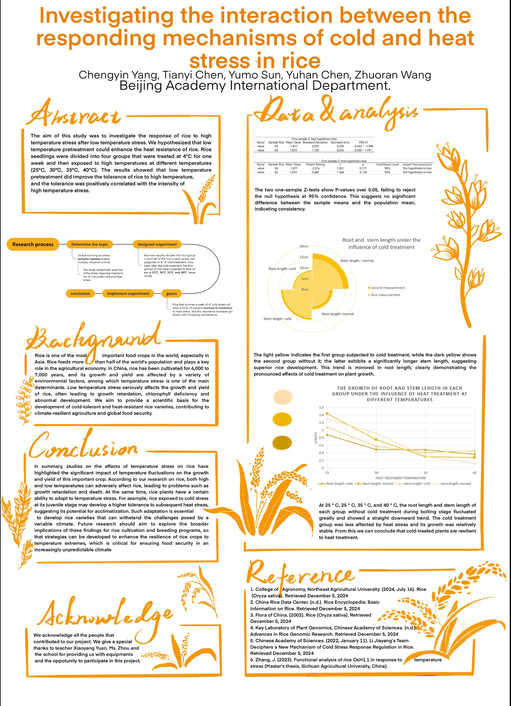
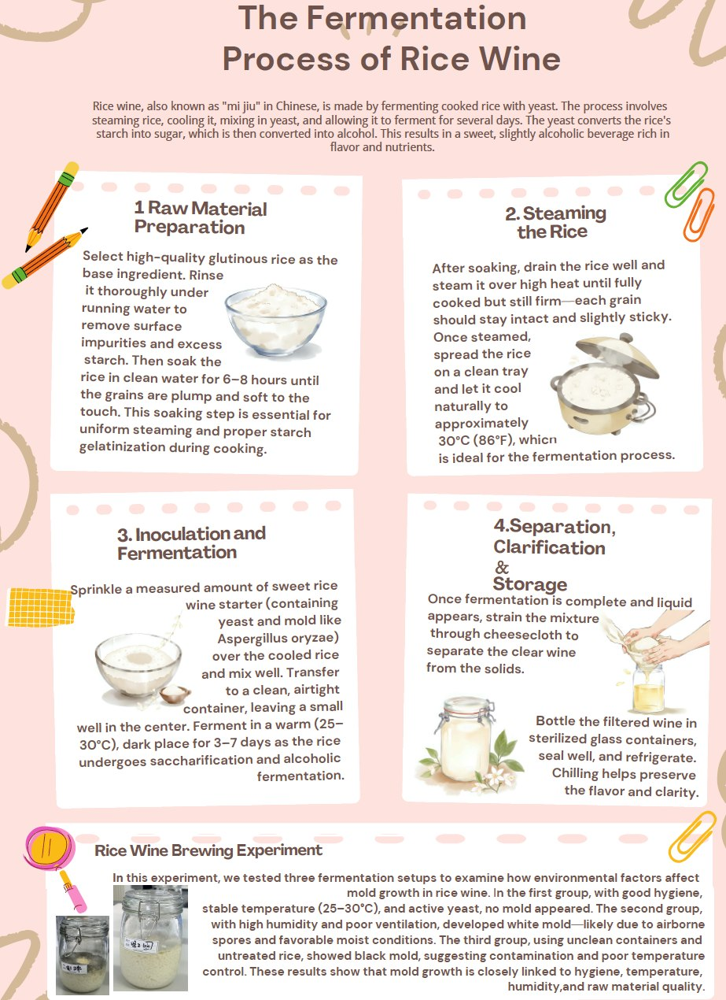
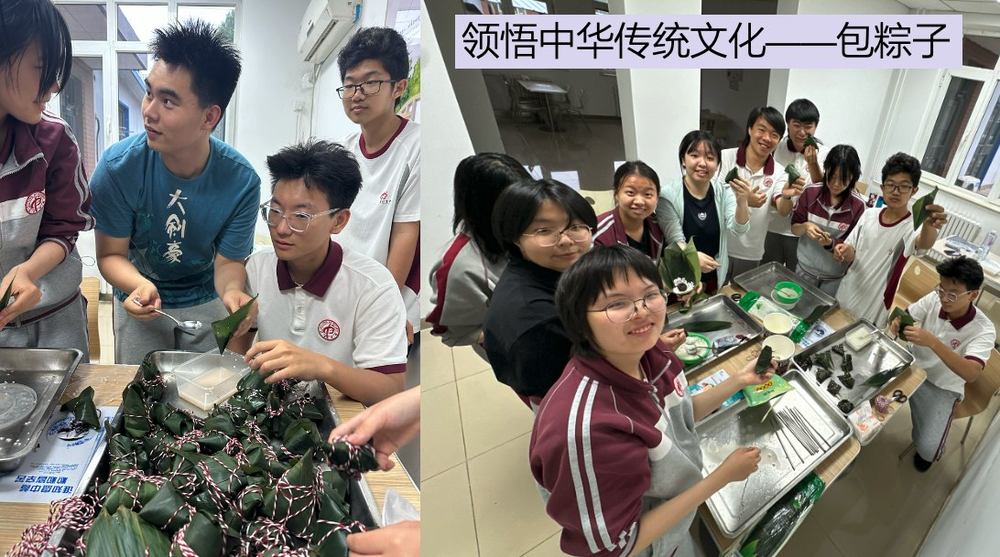
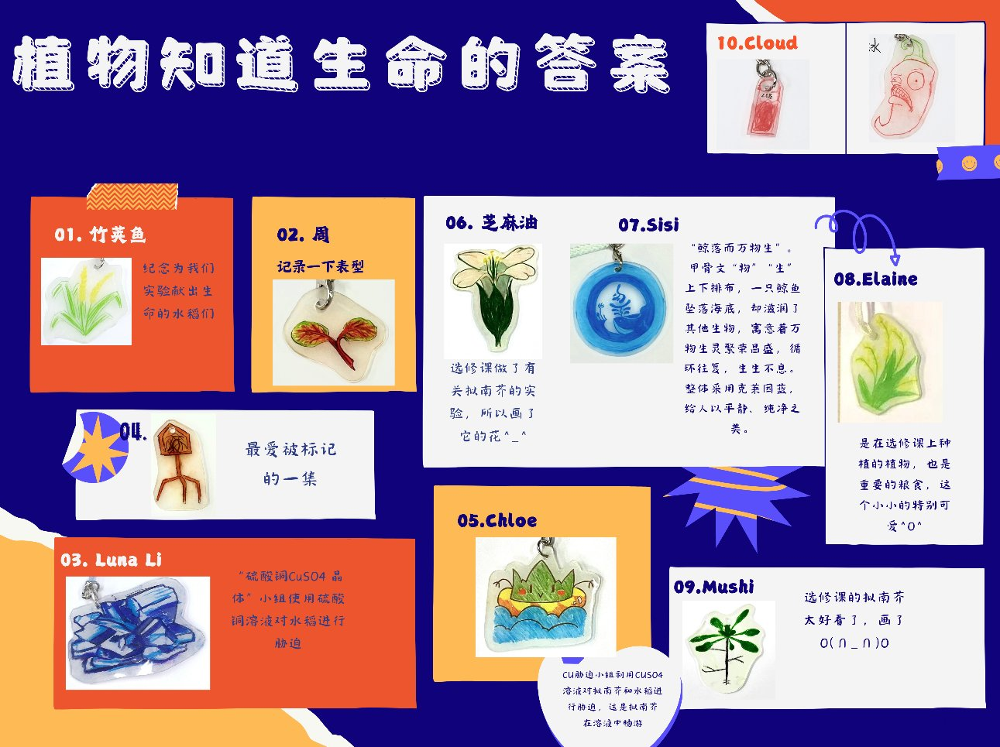

## 课程简介

《植物知道生命的答案》是一门实验性校本课程，旨在激发学生的研究兴趣，通过深度文献阅读和小组合作，引导学生自主发掘并确立研究课题。在实验环节中，学生将系统学习并掌握植物材料的培养方法、试验设计的理论与实践、生长特征的细致观察、生理特性的分析以及形态结构的解读，深入理解外界环境变化对植物生命活动的影响，科学阐释实验结果。本课程着重培养学生发现问题的敏锐性、深度思考的能力、逻辑分析的本领、相对独立的研究精神以及团队协作的默契，为学生未来在大学独立进行毕业实习、撰写毕业论文奠定坚实的实践基础。

  
"Plants Know the Truth of  Life" is an innovative course designed to ignite students' research interests and foster independent exploration. Through intensive literature study and collaborative group work, students are encouraged to identify and develop research topics. The course includes practical sessions where students learn plant cultivation, experimental design and practice,
observation of growth patterns, analysis of physiological characteristics, and interpretation of morphological structures. Emphasizing the impact of environmental changes on plant, students are guided to scientifically analyze experimental results. This curriculum aims to cultivate students' problem-solving acumen, critical thinking skills, logical analysis abilities, independent research spirit, and teamwork dynamics, laying a robust foundation for future independent research and academic projects in college.  

## 课程设计与内容：从理论到实践，构建完整的科研路径
《植物知道生命的答案》旨在帮助学生从“学习者”向“研究者”转变，课程围绕植物生命活动展开，内容涵盖：课程内容围绕植物生命活动展开，涵盖多个模块：

**模块一：文献阅读与课题发掘**
- 学习如何查找并阅读学术论文
- 在教师引导下提炼科学问题，确定研究方向

**模块二：实验设计与操作实践**
- 掌握植物材料的培养与管理方法
- 学习实验设计的基本原则（对照组设置、变量控制、重复样本等）
- 进行生长特征观察、生理生化指标测定

**模块三：数据分析与结果呈现**
- 学习GraphPad Prism和R语言作图技巧
- 理解统计学原理，科学解释实验结果
- 制作科研海报，撰写研究报告

<iframe src="//player.bilibili.com/player.html?isOutside=true&aid=112670497965546&bvid=BV1xi3jeCETW&cid=500001594784506&p=1&high_quality=1&danmaku=0&autoplay=0" allowfullscreen="allowfullscreen" width="100%" height="500" scrolling="no" frameborder="0" sandbox="allow-top-navigation allow-same-origin allow-forms allow-scripts"></iframe>

## 课程特色

**跨学科 · 项目化 · 技术赋能 · 成果导向**

**项目式学习：**学生以小组形式全程参与一个科研项目，经历发现问题->文献查阅->课题确立->实验设计->数据采集->成果展示的完整科研流程，逐步建立起科学研究的基本范式。

**多学科融合：**结合生物学、化学、统计学等知识，提升综合素养。

**技术赋能科研：**引入Graphpad、R语言等科研绘图软件，提升数据可视化与表达能力。

**成果可视化输出：**每组完成科研海报一张、研究报告一份，并进行成果展示。

## 课程成果

课程以3-5人为一组开展研究，每组学生在每学期末完成并生成一张科研海报。部分优秀作品已在校园内展出，展现出扎实的研究成果与良好的科学素养。多名选修课学生在后续参与学校科研项目和科技创新竞赛中表现突出，充分体现了课程所培养的科研能力与实践水平。更有学生反馈，本课程为其撰写大学申请文书、参与高校综合评价面试提供了有力支撑，成为其学术发展道路上的重要助力。

## 近两年研究课题和小组成员

### 宇宙无敌暴龙战士队（辣椒素小组）：李YF、虞CJ、周ZX、齐J、姜L

### 光周期小组：朱JY、赵CY、韩ZY、牛B

### tRNA小组：杨CY、陈TY、孙YM、陈YH、王ZR

### 陆战队（光照小组）：杨CY、杜YX、寇YN、张MY

### 宇宙无敌暴龙战士队（辣椒素小组）：李YF、武JW、虞CJ、周ZX

### 硫酸铜小组：赵KY、李J、朱JY、董YZ

## 选修课花絮

## 选修课专属热缩片

## 学生收获

**孙YM——选课感想**

在众多选修课的宣讲中，《植物知道生命的答案》深深地吸引了我。起初，我对植物的认知仅限于它们是能够进行光合作用的生物，但通过听这次宣讲，我发现植物的世界远比我想象的要丰富多彩。一直以来，我以为植物是一种静止、被动的生命形式。然而，宣讲中提到的植物的各种感知能力，如对光、重力、化学物质的感知，让我对植物产生了全新的认识。植物不仅能够感知环境的变化，还能做出相应的反应，这让我对植物的智慧感到由衷的敬佩。宣讲中提到的许多问题都引起了我的好奇心，比如植物如何感知周围的环境？它们是如何进行交流的？它们是否有记忆？这些问题让我迫不及待地想要深入了解植物的世界。

**李J——上学期感想**

参加培养拟南芥的选修课是一次令人难忘的经历。拟南芥（Arabidopsis thaliana）是一种常用的模式植物，被广泛用于植物生物学研究。参与这样一门课程不仅为我提供了深入了解植物生长和发育的机会，还让我亲身体验了科学实验的乐趣和挑战。课程的学习内容涵盖了拟南芥的生长周期、遗传特性和分子生物学特征等方面。通过理论课程的学习，我对这种植物的生物学特性有了更全面的了解。老师们讲解生长过程中的关键阶段，比如种子萌发、幼苗生长、开花结果等，也使我对植物生长发育有了更深入的认识。

课程的实践环节让我有机会亲自动手进行实验。从播种到观察植株生长，再到收集数据和分析结果，每一个步骤都需要细致和耐心。在实验室中培养拟南芥，我学会了如何处理植物、记录数据以及进行数据分析，这些技能对我的科研学习有着极大的帮助。

不仅如此，参加这门课程也让我领略到科学研究的创新性和不确定性。在实验过程中，由于操作的不规范会导致实验误差从而影响试验结果的准确性，因此我们需要改进实验方法，遵循实验的严谨性。

**赵KY——上学期感想**

“植物知道生命的答案”是一门以做生物实验为主的选修课。在这个学期，我们以模式生物拟南芥为对象，研究有关于植物记忆、视觉、味觉等的实验。我们亲自体验了从播种、浇水、绑苗到记录的整个拟南芥生长过程，虽然经历了一些挫折——有些拟南芥生长状况不佳进行了二次补种——但每个同学都保持着十二分的热情，细心地照顾着每一株拟南芥。最后，我们也制作出了学术海报作为本学期的实验成果。

**杜YX——学年感想**

「植物知道生命的答案」是由「美丽可爱和蔼可亲的苑老师」自主开发的一款全新选修课。游戏发生在一个称作「实验室」的奇妙世界，在这里，天选之子将被授予「海报制作能力」、「论文答辩skills」、「科技之眼」、「洞察之心」，引导生长之力。你将扮演一位名为「未来植物学家」的神秘角色。 在自由的实验中邂逅性格迥异、能力独特的花草们，和他们一起击败强敌，找到他们所适的生长环境——同时，逐步挖掘「植物」的真相。
在这一选修课中，你可以是实验室里手忙脚乱的「勤奋工作者」，也可以是“垂死病中惊坐起”的「赶due人」，还可以是临危不惧松弛感拉满的「汇报者」，亦可以是幕后管理统领全局的「领导者」还有热衷于美术设计以及排版的「艺术家」……请选择你的英雄！
总而言之，“植物知道生命的答案”是一门非常有趣的选修课！不同领域的同学聚集到一起，八仙过海，各显神通：从前期的实验方案设计，到翻土播种，再到发芽后的各种数据测量，需要的是团队精神、创造力和耐心；科研制图、海报设计，以及后期宣传，需要的是每一个人发挥各自所长——编程、美术、写作，等等等等。跨学科的力量，可以支撑我们走很远。
在这里，你不仅能通过种花种草治愈心灵，还能够结识志同道合的好友。还在等什么？Join us！（ps.苑老师还会给每人准备超级丰盛年终奖！）

**虞CJ——学年感想**

“植物知道生命的答案”是以实验为主题的选修课，在课上，我和朋友们可以把一些稀奇古怪的念头落实在手头。虽然收集数据分析数据很令人头疼，但是最后的结果很让人满意。

**杨CY——两学年感想**

植物知道生命的答案选修课陪伴了我两年高中生活，如果给我两个词来形容这门课程，我认为是科学，自由。
首先是科学。苑老师每学年选修课的第一节课，一定会从科学探究基本流程与步骤讲起。其实这个就是后续植物选修课的课程安排，苑老师会带我们严格遵循‘提出问题-提出假设-设计实验-分析结果-结果产出’这个流程进行课题研究。此外，在探讨实验设计过程中，苑老师也很看重无关变量的控制这个事情。所以课题做下来，主打一个科学严谨。
其次是自由。在课题选择过程中，植物选修课是自由选题，以学生自身兴趣作为起始点。就像人类一样，拟南芥会感受到周边环境产生应对与反应，而我们组对于光热胁迫就很感兴趣。所以我觉得比起定题定方向的研究，自主探究对于高中生来说更为宝贵，我们可以自由探索自己感兴趣的未知。并且课堂氛围也是十分自由欢快的，可以结交有趣的人，与趣味相投的人合作完成项目。强推。
总而言之，植物知道生命的答案给我了一个很好的机会去探索关于植物的奥秘，也算是我的研究入门级课程，我体验下来，会和任何高中生推荐这门课。苑笑阳老师也真的，特别特别好，夸张来说，没上过苑老师的课程的人不知道自己错过了什么，为他们感到遗憾。

**李YF——两学年感想**

在高一刚开学的选修课选宣讲上，植物知道生命的答案选修课刚出现的那一瞬间，我就知道这将是我在高一选择的课程，他完美的契合了我的专业兴趣-生物。生物是一个注重实验的学科，但高中课程内的实验其实并不多，植物知道生命的答案选修课则提供了长期进行生物实验的机会，在选修课里，我们学习了基本的实验规则，文献查询技巧，以及植物相关的实验技能。课程内的实验完全由我们自己设计，以小组为单位进行，并有完整的从开题答辩-实验-结题答辩的流程，在每学期的最后小组需要产出这学期实验的实验海报。高一的课程内实验围绕着“植物能感受到什么”的主题来开展，学生可以从六种观感中来选择一个进行相关的实验设计，我们选择的主题是“植物能尝到什么”我们尤其探索了“植物能否唱到辣味”这一主题，用辣椒素溶液胁迫模式植物拟南芥来进行我们的实验。我们最终发现辣椒素会对拟南芥的生长产生负面影响。在这个阶段的学习中我第一次学会拟南芥从播种到收种的完整种植流程以及相关实验设计的规则，尤其是对照组以及控制变量的重要性，这两点也是ap生物的重要考点。而从高一下学期开始，我们的选题变得更加自由，植物的选择也变得多了起来，我们逐渐有了其他两种模式植物—烟草，水稻。我们小组决定持续之前的研究方向，即辣椒素对于植物的影响，所以我们选择在高一下学期探索烟草在辣椒素胁迫下的表现。在这个阶段我又进一步学习了烟草种植的相关技能，并且在第一次实验错误规划辣椒素溶液浓度导致实验结果不明显后明白了预实验的重要性。在高二阶段，我们不仅专注于辣椒素对于植物的持续影响，而是关注另一个方向“植物有记忆么”来进行探究。我们选用的方式是实验收到先前辣椒素胁迫的水稻是否在第二次面对辣椒素胁迫的时候受的影响比首次收到胁迫的小。我们这一次通过扩展实验思路来让我们辣椒素胁迫这一大方向持续不变。高二下学期我们意识到了辣椒素单一化学物质的局限性，于是引入了两种新物质NAA-生长素与ABA-脱落酸来进行胁迫，并且这次我们的实验不在只专注于水稻发芽后的阶段，而且探究了这些化学物质在种子在发芽阶段的影响。我们在选修课中不仅学习到了实验技巧，还有团队合作的重要性，我们小组内严格且高效的分工使得我们在实验进行中收到的阻碍更少，效率更高。并且我们的MFP项目也是由选修课的实验延伸出来的。
综上所述，植物知道生命的答案选修课除了在课内的理论学习之上提供了实验操作的机会，也会对课内学习进行反哺并让其他课程的学习更为顺畅高效。运营自己的实验小组以及产出高质量的研究结果可以说是选修课上最大的乐趣。我个人强烈建议对生物相关领域感兴趣的同学选择植物知道生命的答案选修课。

## 教师视角：让每一颗好奇的种子都有机会发芽。
这两年的教学让我深刻体会到，学生并不是缺乏能力，而是缺少机会。当我们给予他们足够的信任和空间时，往往会收获意想不到的成长和惊喜。我希望学生不仅能了解植物的生命规律，更能学会整个科研流程。这些能力远比知识点本身更为重要，将会伴随他们走向更高阶段的学习。不止于知识传授，更是能力塑造。我希望通过这门课是一个起点，希望学生带着在这里获得的经验与信心，走向更广阔的学术舞台，开启属于自己的科研探索之路。
《植物知道生命的答案》不仅是一门课程，更是一种引导学生走向科研思维、挑战未知的一种尝试。我相信，每一个热爱自然、愿意动手动脑的学生，都能在这片土地上找到属于自己的答案。