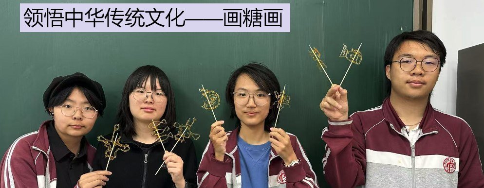
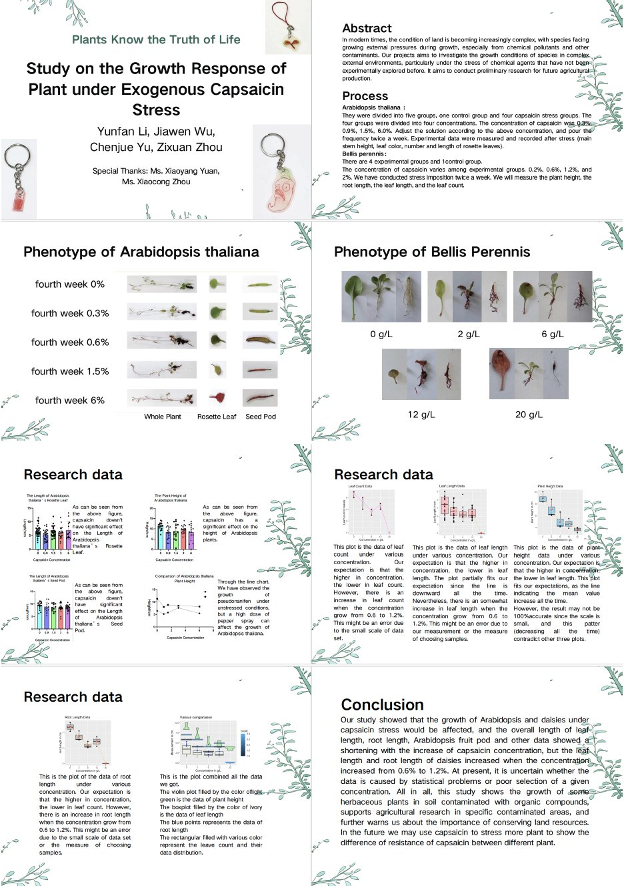

## 课程简介

《植物知道生命的答案》是一门实验性校本课程，旨在激发学生的研究兴趣，通过深度文献阅读和小组合作，引导学生自主发掘并确立研究课题。在实验环节中，学生将系统学习并掌握植物材料的培养方法、试验设计的理论与实践、生长特征的细致观察、生理特性的分析以及形态结构的解读，深入理解外界环境变化对植物生命活动的影响，科学阐释实验结果。本课程着重培养学生发现问题的敏锐性、深度思考的能力、逻辑分析的本领、相对独立的研究精神以及团队协作的默契，为学生未来在大学独立进行毕业实习、撰写毕业论文奠定坚实的实践基础。

  
"Plants Know the Truth of  Life" is an innovative course designed to ignite students' research interests and foster independent exploration. Through intensive literature study and collaborative group work, students are encouraged to identify and develop research topics. The course includes practical sessions where students learn plant cultivation, experimental design and practice,
observation of growth patterns, analysis of physiological characteristics, and interpretation of morphological structures. Emphasizing the impact of environmental changes on plant, students are guided to scientifically analyze experimental results. This curriculum aims to cultivate students' problem-solving acumen, critical thinking skills, logical analysis abilities, independent research spirit, and teamwork dynamics, laying a robust foundation for future independent research and academic projects in college.  

## 2024-2025学年汇报
## 研究课题和小组成员
### 宇宙无敌暴龙战士队（辣椒素小组）：李YF、虞CJ、周ZX、齐J、姜L

### 光周期小组：朱JY、赵CY、韩ZY、牛B

### 陆战队（光照小组）：杨CY、陈TY、孙YM、陈YH、王ZR

## 选修课花絮

## 2023-2024学年汇报视频

<iframe src="//player.bilibili.com/player.html?isOutside=true&aid=112670497965546&bvid=BV1xi3jeCETW&cid=500001594784506&p=1&high_quality=1&danmaku=0&autoplay=0" allowfullscreen="allowfullscreen" width="100%" height="500" scrolling="no" frameborder="0" sandbox="allow-top-navigation allow-same-origin allow-forms allow-scripts"></iframe>

## 研究课题和小组成员
### 陆战队（光照小组）：杨CY、杜YX、寇YN、张MY

### 宇宙无敌暴龙战士队（辣椒素小组）：李YF、武JW、虞CJ、周ZX

### 硫酸铜小组：赵KY、李J、朱JY、董YZ

## 选修课专属热缩片

## 同学感想

**孙YM——选课感想**

在众多选修课的宣讲中，《植物知道生命的答案》深深地吸引了我。起初，我对植物的认知仅限于它们是能够进行光合作用的生物，但通过听这次宣讲，我发现植物的世界远比我想象的要丰富多彩。一直以来，我以为植物是一种静止、被动的生命形式。然而，宣讲中提到的植物的各种感知能力，如对光、重力、化学物质的感知，让我对植物产生了全新的认识。植物不仅能够感知环境的变化，还能做出相应的反应，这让我对植物的智慧感到由衷的敬佩。宣讲中提到的许多问题都引起了我的好奇心，比如植物如何感知周围的环境？它们是如何进行交流的？它们是否有记忆？这些问题让我迫不及待地想要深入了解植物的世界。

**李J——上学期感想**

参加培养拟南芥的选修课是一次令人难忘的经历。拟南芥（Arabidopsis thaliana）是一种常用的模式植物，被广泛用于植物生物学研究。参与这样一门课程不仅为我提供了深入了解植物生长和发育的机会，还让我亲身体验了科学实验的乐趣和挑战。课程的学习内容涵盖了拟南芥的生长周期、遗传特性和分子生物学特征等方面。通过理论课程的学习，我对这种植物的生物学特性有了更全面的了解。老师们讲解生长过程中的关键阶段，比如种子萌发、幼苗生长、开花结果等，也使我对植物生长发育有了更深入的认识。

课程的实践环节让我有机会亲自动手进行实验。从播种到观察植株生长，再到收集数据和分析结果，每一个步骤都需要细致和耐心。在实验室中培养拟南芥，我学会了如何处理植物、记录数据以及进行数据分析，这些技能对我的科研学习有着极大的帮助。

不仅如此，参加这门课程也让我领略到科学研究的创新性和不确定性。在实验过程中，由于操作的不规范会导致实验误差从而影响试验结果的准确性，因此我们需要改进实验方法，遵循实验的严谨性。

**赵KY——上学期感想**

“植物知道生命的答案”是一门以做生物实验为主的选修课。在这个学期，我们以模式生物拟南芥为对象，研究有关于植物记忆、视觉、味觉等的实验。我们亲自体验了从播种、浇水、绑苗到记录的整个拟南芥生长过程，虽然经历了一些挫折——有些拟南芥生长状况不佳进行了二次补种——但每个同学都保持着十二分的热情，细心地照顾着每一株拟南芥。最后，我们也制作出了学术海报作为本学期的实验成果。

**杜YX——学年感想**

「植物知道生命的答案」是由「美丽可爱和蔼可亲的苑老师」自主开发的一款全新选修课。游戏发生在一个称作「实验室」的奇妙世界，在这里，天选之子将被授予「海报制作能力」、「论文答辩skills」、「科技之眼」、「洞察之心」，引导生长之力。你将扮演一位名为「未来植物学家」的神秘角色。
在自由的实验中邂逅性格迥异、能力独特的花草们，和他们一起击败强敌，找到他们所适的生长环境——同时，逐步挖掘「植物」的真相。

总而言之，“植物知道生命的答案”是一门非常有趣的选修课！在这里，你不仅可以通过种花种草治愈心灵，还可以结识志同道合的好友。还在等什么？Join us！（ps.苑老师还会给每人准备超级丰盛年终奖！）

**虞CJ——学年感想**

“植物知道生命的答案”是以实验为主题的选修课，在课上，我和朋友们可以把一些稀奇古怪的念头落实在手头。虽然收集数据分析数据很令人头疼，但是最后的结果很让人满意。